# PROJECT_MASTER.md

# SONORA — AI Retro Music Machine

> **Tagline:** Your music. Your memories. Your AI.  
> **Product thesis:** SONORA is a personal, AI-native music experience that learns not only what a user likes, but when, why, and in what context they like it—while transforming the interface into a living retro-futuristic atmosphere around the music.

---

## 1. Project Overview

### Project Identity

| Field | Definition |
|---|---|
| Project Name | **SONORA** |
| Full Product Name | **SONORA — The AI Retro Music Machine** |
| One-line Description | An AI-powered music player that learns a user's listening rhythm, creates personalized sessions and mixtapes, remembers meaningful songs, and dynamically changes its visual atmosphere with the music. |
| Category | Music / AI / Personalization / Consumer Software |
| Project Type | AI-native music application / web-first product |
| Development Stage | Full Production-Build Blueprint |
| Target Platforms | Web PWA first; desktop/mobile expansion later |
| Primary Objective | Build a differentiated music experience that creates strong daily listening habits through personalization, context, memory, and adaptive visual design. |
| Secondary Objectives | Demonstrate advanced full-stack engineering, recommender systems, AI orchestration, audio UI, product design, and scalable architecture. |
| Initial Audience | Students, young professionals, music enthusiasts, creators, developers, and users who value aesthetic/personalized listening experiences. |
| Initial Market Position | A companion/experience layer around licensed or user-owned music, not a rights-owning music catalog. |

### Detailed Description

SONORA is not intended to be a generic Spotify clone or a chatbot wrapped around a media player.

The product combines:

1. A polished retro-futuristic player.
2. Context-aware AI recommendations.
3. A **Pulse** engine that learns time-based listening habits.
4. An **Atmosphere** engine that adapts colors, motion, textures, and visual effects to the music.
5. **Music DNA** that explains and visualizes the user's taste.
6. **Memory** that connects songs to personal notes, moments, and life stages.
7. **Tape** that turns playlists into personalized digital mixtapes.
8. AI-assisted discovery, conversational control, and music explanation.
9. **SONORA Together** — synchronized listening rooms for couples, friends, and family, with fair queue priority, shared Atmosphere, reactions, and privacy-aware messaging.
10. Optional social experiences such as Dual Tape and shareable music identity cards.

The product must prove one core loop:

> **Open SONORA → instantly get a relevant session → listen → SONORA learns → next session gets better.**

### Elevator Pitch

SONORA is an AI-native music player that learns your listening rhythm, not just your favorite songs. It can prepare the right music for a time and activity, transform the interface to match the sound, remember the personal meaning behind songs, and turn moments into living retro mixtapes. The long-term goal is to make music feel less like a catalog and more like a personal world.

---

## 2. Problem Statement

### Existing Problem

Most music applications are excellent at providing access to large catalogs, but a large catalog does not automatically create a deeply personal listening experience.

Users frequently face:

- Search fatigue.
- Repetitive recommendations.
- Too many playlists with little context.
- Weak connection between music and personal memories.
- Limited understanding of *why* a recommendation was selected.
- Recommendation systems that are useful but feel invisible.
- Interfaces that remain visually static while the music changes.
- Manual effort required to choose music for recurring moments.
- Difficulty discovering new music without leaving their comfort zone.
- Fragmentation between listening history and personal memories.

### Who Experiences the Problem?

Primary users:

- Students and young adults.
- Heavy music listeners.
- Playlist creators.
- Users who listen at recurring times of day.
- Users who enjoy visual and nostalgic interfaces.
- Music discovery enthusiasts.

Secondary users:

- Creators and musicians.
- Social groups/friends sharing music.
- Developers and design/technology enthusiasts.
- Users managing personal/local music libraries.

### Why the Problem Exists

Traditional music products optimize heavily for catalog access, search, playback, recommendation, and engagement.

SONORA focuses on a different question:

> **How can the listening experience itself become adaptive, memorable, explainable, and expressive?**

### Current Solution Categories

The market includes:

- Large streaming platforms.
- Curated playlists.
- Algorithmic recommendations.
- AI DJs and conversational recommendation.
- Manual music libraries.
- Social music sharing.
- Music visualization apps.

Current major platforms are increasingly adding natural-language music discovery, personalized DJ experiences, prompted playlists, richer song context, and intelligent transitions. Spotify's 2026 product communications explicitly describe this shift from inferred intent toward users directly expressing intent with generative AI; Spotify also documents Prompted Playlist, DJ requests, Talk to Spotify, and SongDNA. Apple Music has expanded intelligent AutoMix and lyrics translation/pronunciation capabilities. These market directions are treated as signals, not features SONORA should blindly copy. **Verification is required again before launch because the market can change.**

### Limitations of Existing Approaches

Potential limitations SONORA can address:

| Limitation | SONORA Opportunity |
|---|---|
| Recommendation feels opaque | Explainable recommendations |
| User must manually search | Context-aware one-tap sessions |
| Static UI | Adaptive Atmosphere |
| Listening history is mostly recommendation input | Turn history into a personal story |
| Playlist is mainly a list | Turn playlist into a Tape artifact |
| Discovery can be repetitive | Controlled familiar/similar/surprise mix |
| Music memories are disconnected | Song + memory model |
| Social sharing often focuses on links | Shareable music identity and tapes |

### Consequences of the Problem

If a product only provides playback:

- Users may listen and leave.
- Personalized value is difficult to feel.
- Switching costs remain low.
- Product identity becomes dependent on catalog size.
- AI becomes a superficial layer rather than a core experience.

### Opportunity

SONORA can build a differentiated experience around **taste + time + context + memory + atmosphere + identity**.

---

## 3. Proposed Solution

### Solution Overview

SONORA combines five core intelligence loops:

1. **Taste Intelligence** — learns what the user likes.
2. **Pulse Intelligence** — learns when/contextually how the user listens.
3. **Atmosphere Intelligence** — adapts the interface and visual environment.
4. **Memory Intelligence** — connects songs with meaningful user memories.
5. **Discovery Intelligence** — balances familiar music with useful novelty.

### Core Workflow

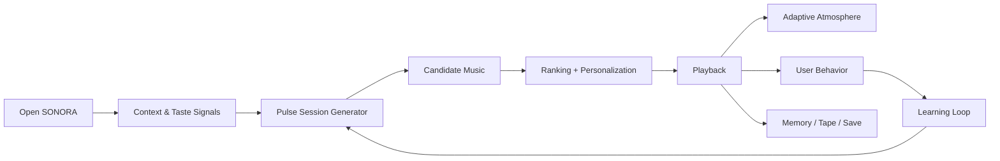

### Main Value Proposition

> **SONORA reduces the effort of deciding what to listen to while making each listening session more personal, expressive, and memorable.**

### Why Users Would Use It

- It starts music faster.
- It learns their recurring listening patterns.
- It gives them a beautiful adaptive environment.
- It can explain recommendations.
- It makes discovery feel intentional.
- It turns listening history into memories and artifacts.

### Why Users Would Continue Using It

The product should improve with continued use:

> More listening → better context model → better sessions → more memories/tapes → stronger personal identity → greater value.

### Core Value Proposition

**“The music player that learns your rhythm.”**

### Unique Selling Proposition (USP)

**SONORA combines context-aware music personalization with a dynamic retro-futuristic interface and a personal music-memory layer.**

The core differentiator is not “AI creates playlists.” The differentiator is:

> **AI changes what you hear, why you hear it, and how the entire product feels while you hear it.**

---

## 4. Target Users

### Primary User Personas

| Persona | Description | Goals | Problems | Needs | Usage |
|---|---|---|---|---|---|
| The Routine Listener | Listens around predictable times | Start music quickly | Repeated manual selection | Time-aware sessions | Daily |
| The Explorer | Loves discovering artists/genres | Find hidden gems | Recommendations can be repetitive | Controlled novelty | 3–7x/week |
| The Aesthetic Listener | Cares about design/visuals | Have a beautiful listening experience | Static music interfaces | Adaptive visuals | Daily |
| The Memory Keeper | Attaches songs to moments | Preserve personal memories | Music history feels disposable | Song-memory relationships | Weekly/monthly |
| The Mixtape Maker | Creates playlists for people/events | Make personal collections | Manual curation takes time | AI-assisted tapes | Weekly |

### Secondary Personas

| Persona | Description | Goals | Problems | Needs | Usage |
|---|---|---|---|---|---|
| Creator | Shares music/tapes | Build an identity around curation | Hard to package taste | Shareable artifacts | Weekly |
| Music Learner | Wants song/artist context | Understand music | Information is fragmented | Song intelligence | Weekly |
| Friend Pair | Wants shared listening | Find overlap | Different tastes | Joint discovery | Occasional |
| Local Music User | Has own audio files | Organize/experience files | File libraries are messy | Personal library tooling | Weekly |

### Primary User

A student/young adult aged approximately 18–30 who listens to music frequently and values personalized experiences and visual design.

### Secondary User

A music enthusiast who enjoys discovery, playlists, nostalgia, and sharing.

### Admin / Internal User

A trusted operator responsible for moderation, support, analytics, system configuration, audit logs, and operational controls.

---

## 5. User Stories

### Primary User Stories

1. As a user, I want to create an account so that my taste and listening history can be associated with my profile.
2. As a user, I want to play a song so that I can listen without leaving the application.
3. As a user, I want to search for music so that I can find a specific track/artist.
4. As a user, I want SONORA to generate a session for my current activity so that I do not have to manually choose songs.
5. As a user, I want SONORA to learn my repeated listening times so that relevant music can be prepared for recurring moments.
6. As a user, I want the interface theme to adapt to the current music so that the experience feels alive.
7. As a user, I want SONORA to explain why a recommendation was selected so that I can understand it.
8. As a user, I want to save a song/playlist so that I can return to it later.
9. As a user, I want to create an AI-assisted Tape so that I can turn a music concept into a curated artifact.
10. As a user, I want to attach a note/memory to a song so that I can preserve why it matters to me.
11. As a user, I want to control personalization settings so that I can choose how much AI influence I receive.
12. As a user, I want to disable adaptive visuals so that playback remains distraction-free.

### Advanced User Stories

1. As a user, I want to ask SONORA in natural language for a listening session.
2. As a user, I want a conversational AI DJ to guide a listening session.
3. As a user, I want SONORA to build a visual journey across an entire playlist.
4. As a user, I want to explore the creative relationships around a song.
5. As a user, I want to see how my taste changes over time.
6. As a user, I want SONORA to generate a personal yearly/semester soundtrack.
7. As a user, I want to create a shared Tape with another user.
8. As a user, I want to discover music that is slightly outside my normal taste.
9. As a user, I want to ask questions about a song's meaning or musical characteristics.
10. As a user, I want to revisit music from a specific period of my life.
11. As a creator, I want to publish a Tape or listening card.
12. As an admin, I want to observe AI errors and recommendation quality.
13. As a user, I want to create a private Together room so that I can listen with friends, a partner, or family.
14. As a room host, I want to assign member roles and queue influence so that playback control stays fair.
15. As a room member, I want my suggested songs to compete using group priority and votes so that everyone gets represented.
16. As a room member, I want synchronized playback so that everyone hears the same song at approximately the same point.
17. As a room member, I want to send private messages and reactions in the room without exposing my full listening history.
18. As a room member, I want the shared visual atmosphere to react to the room's music so that the group session feels unified.
19. As a couple, I want a shared Tape and shared memories so that important music moments can become relationship artifacts.
20. As a family, I want stronger moderation and role controls so that shared listening remains appropriate and manageable.

---

## 6. User Journey

### Primary Journey

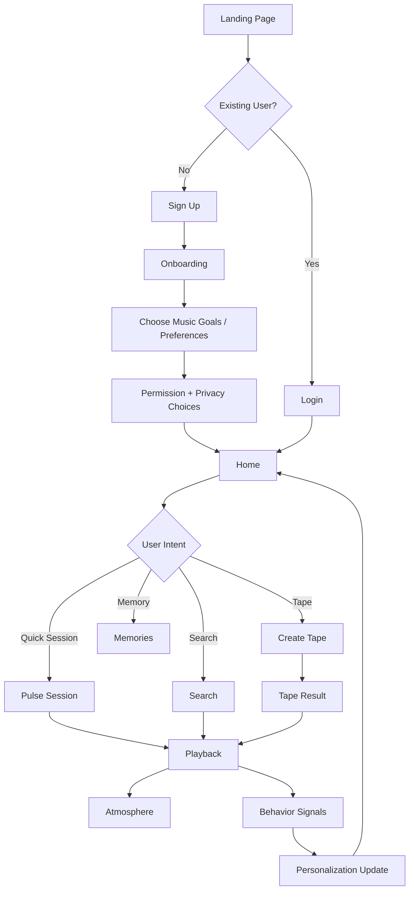

### Retention Journey

1. First session delivers immediate value.
2. Second session uses early behavior.
3. By week one, Pulse identifies recurring patterns.
4. By week two, Music DNA becomes meaningful.
5. By week three, Memories/Tapes can represent personal identity.
6. Long-term usage improves recommendations and personal history.

---

## 7. Functional Requirements

| ID | Requirement | Priority | User | Description | Acceptance Criteria |
|---|---|---|---|---|---|
| FR-001 | User registration | P0 | User | Create account with email/password or supported auth provider | Account created, verified, error states handled |
| FR-002 | User login | P0 | User | Authenticate user | Valid user enters app; invalid login rejected safely |
| FR-003 | Music search | P0 | User | Search supported catalog/provider | Results show relevant tracks/artists |
| FR-004 | Playback | P0 | User | Play/pause/seek/next/previous | Playback state remains consistent |
| FR-005 | Queue | P0 | User | Manage upcoming tracks | Add/remove/reorder works |
| FR-006 | Save music | P0 | User | Save/unsave tracks and playlists | State persists |
| FR-007 | Session generation | P0 | User | Generate personalized session | Session contains ranked tracks |
| FR-008 | Pulse tracking | P0 | User | Track timestamped listening behavior | Events stored with privacy controls |
| FR-009 | Adaptive theme | P0 | User | Apply music-driven theme | Theme changes without breaking playback |
| FR-010 | Theme controls | P0 | User | Auto/static/subtle/full modes | User setting persists |
| FR-011 | Recommendation explanation | P1 | User | Show rationale | Explanation corresponds to available signals |
| FR-012 | Tape generation | P1 | User | Create AI-assisted mixtape | Tape includes name, concept, tracks, visual theme |
| FR-013 | Memory creation | P1 | User | Attach personal note to song | Memory saved and retrievable |
| FR-014 | Music DNA | P1 | User | Generate taste profile | Profile based on observed data and confidence |
| FR-015 | Surprise Me | P1 | User | Provide controlled discovery | Recommendation differs from immediate repeats |
| FR-016 | Personal settings | P0 | User | Control personalization/privacy | Settings apply consistently |
| FR-017 | Logout | P0 | User | End active session | Tokens/session invalidated according to chosen strategy |
| FR-018 | Error states | P0 | User | Standard UX for failures | No broken blank screens |
| FR-019 | Admin audit logs | P1 | Admin | Review important system actions | Restricted to admin |
| FR-020 | Health endpoint | P0 | System | Check service status | Returns operational state without secret leakage |

---

## 8. Non-Functional Requirements

| Area | Proposed Requirement |
|---|---|
| Performance | UI interactions should feel responsive; proposed target: p95 API latency under 500 ms for ordinary non-AI requests under initial production load. |
| AI latency | Proposed target: initial AI result under 5 seconds for common requests, with streaming or progress UI where practical. |
| Scalability | Architecture should support growth from ~100 to 100,000+ registered users without immediate rewrite. |
| Security | Secure authentication, validation, rate limits, secret management, and least-privilege access. |
| Availability | Target 99.5% initial service availability; production targets require measurement and budget review. |
| Reliability | Idempotent critical operations and graceful third-party failures. |
| Maintainability | Modular boundaries, typed contracts, tests, ADRs, and documentation. |
| Accessibility | WCAG-aligned practices with keyboard support, contrast, labels, focus states, and reduced motion. |
| Usability | A first-time user should reach playable music in a small number of deliberate steps. |
| SEO | Marketing pages should be indexable; authenticated application routes need not be publicly indexed. |
| Compatibility | Current evergreen browsers; mobile-first responsive behavior. |
| Localization | Architecture should allow localization; initial release may support English first with Hindi-ready strings. |
| Privacy | Explicit control for personalization, history, memory, and data deletion. |
| Observability | Centralized structured logs, errors, metrics, health checks, and alerts. |

---

## 9. Full Product Build Scope

The project is planned as one continuous production-oriented build. We do not create a separate Core Build track, Expansion track, or Together track inside the master plan.

### 9.1 Personal Listening Core

| Feature | Priority | Complexity | Dependency | Build Window | Status |
|---|---|---|---|---|---|
| Authentication | P0 | Medium | DB | Days 9–14 | Planned |
| User onboarding | P0 | Medium | Auth | Days 12–15 | Planned |
| Music provider abstraction | P0 | High | Provider decision | Days 15–17 | Planned |
| Search | P0 | Medium | Provider | Days 17–18 | Planned |
| Playback engine | P0 | High | Audio/provider | Days 18–20 | Planned |
| Queue | P0 | Medium | Playback | Days 20–21 | Planned |
| Listening event pipeline | P0 | Medium | Auth + DB | Days 21–23 | Planned |
| Pulse engine | P0 | High | Events | Days 23–26 | Planned |
| Session generator | P0 | High | Pulse + ranking | Days 26–29 | Planned |
| Adaptive Atmosphere | P0 | High | Player + theme engine | Days 29–32 | Planned |
| Privacy/settings | P0 | Medium | Auth | Days 12–16, 34 | Planned |

### 9.2 Intelligence Layer

| Feature | Priority | Complexity | Dependency | Build Window | Status |
|---|---|---|---|---|---|
| Music DNA | P1 | Medium–High | History + ranking | Days 33–36 | Planned |
| Why This Song | P1 | Medium | Recommendation signals | Days 35–36 | Planned |
| Controlled Surprise Me | P1 | Medium | Ranking | Days 36–37 | Planned |
| AI-assisted Tape generation | P1 | High | AI + playback + ranking | Days 37–40 | Planned |
| Memory system | P1 | Medium | DB + privacy | Days 38–40 | Planned |
| Natural-language AI DJ | P1 | High | AI gateway + session engine | Days 40–42 | Planned |
| Song intelligence | P1 | High | Metadata/provider | Days 41–42 | Planned |
| Taste timeline | P2 | Medium | History + DNA | Days 43–44 | Planned |
| Shareable Tape / identity cards | P2 | Medium | Tape + public-safe rendering | Days 44–45 | Planned |

### 9.3 SONORA Together + Social Layer

| Feature | Priority | Complexity | Dependency | Build Window | Status |
|---|---|---|---|---|---|
| Private listening rooms | P1 | Very High | Auth + realtime | Days 46–48 | Planned |
| Room membership + roles | P1 | High | Rooms | Days 46–48 | Planned |
| Presence | P1 | Medium | Realtime | Days 47–48 | Planned |
| Authoritative synchronized playback | P1 | Very High | Playback + realtime | Days 48–50 | Planned |
| Shared queue + fairness | P1 | High | Queue + rooms | Days 50–51 | Planned |
| Group voting / recommendation | P1 | High | Group signals | Days 51–52 | Planned |
| Shared Atmosphere | P2 | High | Atmosphere + realtime | Days 52–53 | Planned |
| Reactions + time-linked comments | P2 | High | Realtime | Days 53–54 | Planned |
| Private room messaging | P2 | High | Secure transport | Days 53–55 | Planned |
| Audited E2EE protocol/library integration | P1 | Very High | Threat model + key lifecycle | Days 54–56 | Planned |
| Couple Mode | P2 | High | Together | Days 55–56 | Planned |
| Family Mode + moderation | P2 | High | Together + abuse controls | Days 56–57 | Planned |
| Dual Tape | P2 | High | Tape + social identity | Days 56–57 | Planned |
| Song Universe | P2 | High | Metadata graph | Days 57–58 | Planned |
| Time Machine | P2 | Medium–High | History + memory | Days 57–58 | Planned |
| Music Adventure | P2 | High | Discovery | Days 58–59 | Planned |
| Creator profiles | P2 | High | Public artifacts | Days 58–59 | Planned |

### 9.4 Explicitly Out of the 60-Day Production Build

These remain research/expansion candidates because they introduce separate platform, licensing, hardware, or large-scale infrastructure constraints:

- on-device recommendation components,
- wearable context integrations,
- personalized generated voice radio requiring separate rights/licensing,
- high-cost generative visual environments requiring dedicated GPU/WebGL optimization,
- large-scale public listening rooms with internet-scale moderation and realtime infrastructure,
- custom cryptographic algorithms or home-grown E2EE protocols.

These are not deleted from the product vision; they are kept outside the 60-day production candidate so the committed build stays coherent.

## 10. Release Scope Model

| Build Band | Meaning | Included in 60-Day Build? |
|---|---|---|
| Core Product | Authentication, music access, playback, queue, Pulse, sessions, Atmosphere, privacy | Yes |
| Intelligence Product | DNA, explanations, discovery, Tape, Memory, AI DJ, song intelligence | Yes |
| Social Product | Together rooms, sync, fairness, reactions, messaging, modes, social artifacts | Yes, subject to external-provider and security gates |
| Production Operations | Testing, security, observability, backups, CI/CD, staging, deployment, recovery | Yes |
| Experimental Platform | Wearables, on-device intelligence, large public rooms, advanced generative environments | No; separate program |

### Scope discipline

A feature enters the committed build only when it can be traced to a user need, product requirement, technical dependency, security requirement, or operational requirement. A feature that fails traceability is marked `[SCOPE REVIEW REQUIRED]`.

## 11. Competitive Analysis

> **Important:** Competitive capabilities change quickly. Re-verify all current feature availability, markets, licensing, and APIs before implementation.

| Product | Strengths | Weaknesses / Gaps for SONORA | Our Advantage |
|---|---|---|---|
| Spotify | Large catalog, recommendation ecosystem, AI DJ, Prompted Playlist, conversational experiences, rich music discovery | Extremely broad platform; difficult for a new product to differentiate at catalog scale | Focus narrowly on adaptive atmosphere, memories, personal tapes, and transparent habit intelligence |
| Apple Music | Strong ecosystem, audio features, lyrics/AutoMix intelligence | Ecosystem-centered experience; catalog parity/availability depends on region | Retro-futuristic identity + explicit personal memory layer |
| YouTube Music | Huge video/music discovery surface | Video-first ecosystem can create a less dedicated “music machine” feeling | Purpose-built listening environment |
| Dedicated local music players | Control over local files and playback | Usually weaker personalization and AI | AI organization + adaptive experience for user-owned music |

Market verification snapshot: Spotify has publicly described AI-assisted DJ, Prompted Playlist, direct user intent, Talk to Spotify and SongDNA during 2026; Apple has publicly described AutoMix and expanded lyrics intelligence. These facts are used only to inform product positioning and must be rechecked before launch.

---

## 12. Competitive Differentiation

### What Makes SONORA Different?

SONORA's differentiation should come from the combination of:

1. **Adaptive Atmosphere** — UI changes with music.
2. **Pulse** — learns *when* the user listens.
3. **Memory** — remembers what songs mean to the user.
4. **Tape** — turns music collections into personal artifacts.
5. **DNA** — visualizes and explains taste.
6. **Explainability** — gives a useful reason for recommendations.
7. **Controlled Discovery** — balances familiar and novel music.

### Why Users Should Choose It

Not because SONORA has the largest catalog.

Choose SONORA because:

> **It feels like your own music machine.**

### Potential Moat

Potential long-term moats:

- Longitudinal preference data.
- User-authored music memories.
- Personal listening context patterns.
- Personalized tape history.
- Taste graph / embeddings.
- Strong visual brand identity.
- Personalization feedback loop.
- Social artifacts generated from personal taste.

The moat is not raw AI access. Models are replaceable.

The moat is:

> **user-specific history + product experience + contextual personalization + trust.**

---

## 13. Tech Stack

### Recommended Stack

| Layer | Choice | Why |
|---|---|---|
| Web Frontend | Next.js + React + TypeScript | Mature React ecosystem, routing, SSR/metadata support for public pages, strong developer productivity |
| Styling | Tailwind CSS | Fast iteration and consistent design tokens |
| UI Components | Radix UI or a small internal component system | Accessible primitives; avoid overbuilding |
| Animation | Framer Motion / Motion | Useful for theme transitions and micro-interactions |
| Graphics | CSS + Web Audio API first; Three.js only when necessary | Keep the production build performant; use WebGL only for meaningful visuals |
| Client State | Zustand | Simple global UI state without excessive framework complexity |
| Server State | TanStack Query | Caching, loading/error lifecycle, request synchronization |
| Forms | React Hook Form + Zod | Efficient forms and typed validation |
| Backend | Node.js + TypeScript + NestJS | Structured modules, validation, DI, scalable backend organization |
| API | REST `/api/v1` | Simple and compatible with web/mobile clients; no need for GraphQL in the initial architecture unless evidence later requires it |
| ORM | Prisma | Type-safe database access and migrations |
| Database | PostgreSQL | Strong relational model and extensibility |
| Vector Search | pgvector initially | Keep vectors with product data; avoid separate database early |
| Cache | Redis | Session/cache/rate-limit use cases |
| Object Storage | S3-compatible storage | Scalable storage for generated covers/assets |
| AI Gateway | Provider abstraction in backend | Prevent vendor lock-in and enable fallback models |
| AI Models | Provider-agnostic LLM; exact model selected after cost/quality evaluation | Model capabilities/pricing change |
| Embeddings | Provider-specific embedding API or open-source embedding model | Depends on cost/privacy/quality |
| Audio | Provider abstraction + Web Audio API | Keeps music source replaceable |
| Testing | Vitest/Jest + Playwright | Unit/integration + browser E2E |
| API Contract | OpenAPI | Contract visibility and easier client integration |
| Logging | Pino + structured JSON logs | Fast structured logging |
| Error Tracking | Sentry or equivalent | Frontend/backend error visibility |
| Analytics | PostHog or equivalent | Product analytics and feature usage |
| Containers | Docker | Reproducible dev/staging/prod environment |
| CI/CD | GitHub Actions | Integrated source-control workflow |
| Web Hosting | Vercel or equivalent for frontend | Convenient deployment; verify cost/limits |
| API Hosting | Render/Fly.io/Cloud Run/AWS equivalent | Pick based on load, budget, and operational comfort |
| Database Hosting | Managed PostgreSQL provider | Backups and operations |
| Domain/CDN | Cloudflare or equivalent | DNS, TLS, CDN, edge controls |

### Why PostgreSQL?

SONORA has strongly relational data:

- users
- sessions
- tracks
- playlists/tapes
- memories
- preferences
- events
- recommendation feedback

PostgreSQL supports reliable transactions and can also support vector search through pgvector.

### Why NOT Microservices in the Initial Architecture?

Because the initial product is being built by a small team/student developer.

Use a **modular monolith** first.

Split services only when measurable scale or team boundaries justify it.

### Alternative Stack

- Frontend: React + Vite
- Backend: Fastify or Express + TypeScript
- ORM: Drizzle
- DB: PostgreSQL
- Cache: Redis
- AI: provider abstraction
- Hosting: Docker + a managed VPS/cloud
- Mobile: React Native/Expo later

---

## 14. System Architecture

### High-Level Architecture

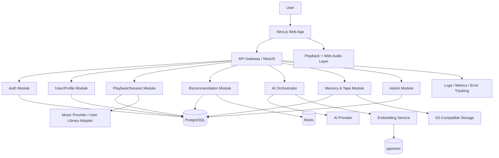

### Authentication Flow

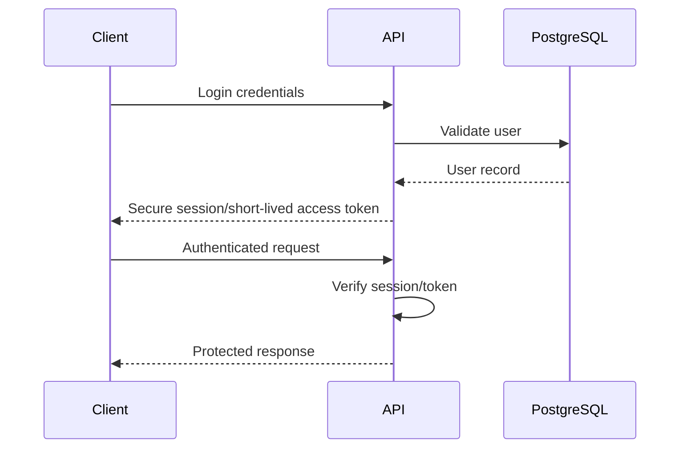

### Product Data Flow

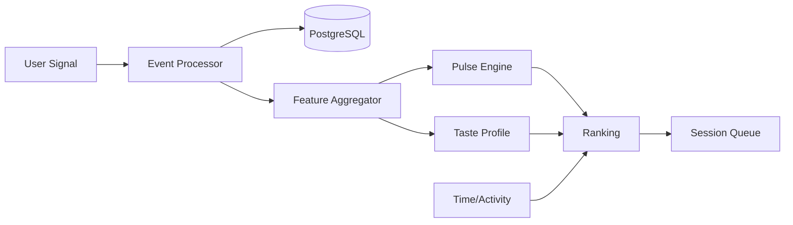

---

## 15. Detailed Architecture

### Frontend Layer

Responsibilities:

- Routing.
- UI components.
- Playback controls.
- Theme rendering.
- Local preferences.
- Client-side validation.
- API communication.
- Optimistic UI where safe.
- Accessibility.
- Analytics event dispatch.

Do not put business-critical recommendation logic in the browser.

### API Layer

Responsibilities:

- Authentication.
- Authorization.
- Request validation.
- Rate limits.
- Request tracing.
- DTOs/contracts.
- Error normalization.

### Business Logic Layer

Modules:

- Auth.
- User.
- Music.
- Playback/session.
- Recommendation.
- Pulse.
- Atmosphere.
- Tape.
- Memory.
- Analytics.
- Admin.
- Together / Rooms.
- Realtime / Presence.
- Messaging / secure-chat adapter.
- Social graph / relationships.

### Data Layer

PostgreSQL stores durable state.

Redis stores temporary/cached state.

Object storage stores generated assets.

### AI Layer

The AI layer should be treated as an orchestration system, not a single `/chat` endpoint.

Core components:

- Prompt/intent parser.
- Context builder.
- Retrieval layer.
- Personalization context.
- Tool/action layer.
- Output validation.
- Cost/latency controls.
- Fallback handling.

### External Services Layer

Potential integrations:

- Licensed/authorized music provider.
- AI model provider.
- Embedding provider.
- Storage provider.
- Email provider.
- Error tracking.
- Analytics.
- Realtime transport (WebSocket/WebRTC where justified).
- Secure messaging / E2EE protocol or audited library.

All providers must be behind adapters/interfaces wherever practical.

**E2EE note:** cryptography must not be custom-designed for production. Select an established, independently reviewed protocol/library, document the threat model, and complete security review before claiming production-grade end-to-end encryption.

### Infrastructure Layer

- Managed Postgres.
- Redis.
- Containerized API.
- CDN/edge.
- CI/CD.
- Monitoring.
- Backups.

---

## 16. Folder Structure

```text
sonora/
├── apps/
│   └── web/
│       ├── app/
│       ├── components/
│       ├── features/
│       ├── hooks/
│       ├── lib/
│       ├── stores/
│       ├── styles/
│       ├── public/
│       └── tests/
│
├── services/
│   └── api/
│       ├── src/
│       │   ├── modules/
│       │   │   ├── auth/
│       │   │   ├── users/
│       │   │   ├── music/
│       │   │   ├── playback/
│       │   │   ├── sessions/
│       │   │   ├── recommendations/
│       │   │   ├── pulse/
│       │   │   ├── atmosphere/
│       │   │   ├── tapes/
│       │   │   ├── memories/
│       │   │   ├── analytics/
│       │   │   └── admin/
│       │   ├── common/
│       │   ├── config/
│       │   └── main.ts
│       └── test/
│
├── packages/
│   ├── ui/
│   ├── types/
│   ├── config/
│   └── eslint-config/
│
├── database/
│   ├── prisma/
│   │   ├── schema.prisma
│   │   └── migrations/
│   └── seeds/
│
├── ai/
│   ├── prompts/
│   ├── schemas/
│   ├── agents/
│   ├── retrieval/
│   ├── embeddings/
│   ├── evaluators/
│   └── fixtures/
│
├── docs/
│   ├── architecture/
│   ├── api/
│   ├── database/
│   ├── ui-ux/
│   ├── security/
│   ├── deployment/
│   ├── testing/
│   └── decisions/
│
├── scripts/
├── tests/
├── .github/
│   ├── workflows/
│   └── ISSUE_TEMPLATE/
├── .env.example
├── docker-compose.yml
├── package.json
├── pnpm-workspace.yaml
├── README.md
└── PROJECT_MASTER.md
```

### Folder Responsibilities

| Folder | Purpose |
|---|---|
| `apps/web` | Web product |
| `services/api` | Backend |
| `packages` | Shared code |
| `database` | Schema/migrations/seeds |
| `ai` | AI prompts, evaluators, retrieval |
| `docs` | Long-form technical documentation |
| `tests` | Cross-system tests |
| `scripts` | Setup/maintenance utilities |

---

## 17. Database Design

### Core Entities

1. User
2. Profile
3. UserPreference
4. ListeningEvent
5. MusicItem
6. Artist
7. Album
8. Playlist
9. PlaylistItem
10. Tape
11. TapeItem
12. Memory
13. TasteProfile
14. TasteSnapshot
15. Session
16. SessionItem
17. Recommendation
18. RecommendationFeedback
19. AtmosphereProfile
20. UserThemePreference
21. AIConversation
22. AIGeneratedAsset
23. AuthSession
24. TogetherRoom
25. RoomMember
26. RoomPlaybackState
27. RoomQueueItem
28. RoomVote
29. RoomReaction
30. RoomMessage
31. Relationship
32. E2EEKeyMetadata
33. AuditLog

### User

| Field | Type | Required | Default | Description |
|---|---|---|---|---|
| id | UUID | Yes | generated | Primary key |
| email | citext/string | Yes | — | Unique login identifier |
| password_hash | text | No | null | Hashed credential if password auth used |
| status | enum | Yes | ACTIVE | Account status |
| role | enum | Yes | USER | Authorization role |
| created_at | timestamp | Yes | now | Creation timestamp |
| updated_at | timestamp | Yes | now | Modification timestamp |
| deleted_at | timestamp | No | null | Soft deletion marker |

Indexes:
- unique(email)
- status
- created_at

### Profile

| Field | Type | Required | Default | Description |
|---|---|---|---|---|
| id | UUID | Yes | generated | PK |
| user_id | UUID | Yes | — | FK to User |
| display_name | varchar | Yes | — | User-facing name |
| avatar_url | text | No | null | Profile image |
| bio | text | No | null | Optional |
| locale | varchar | Yes | `en-IN` | Display locale |
| timezone | varchar | Yes | configured | User timezone |
| created_at | timestamp | Yes | now | Created |
| updated_at | timestamp | Yes | now | Updated |

### UserPreference

Stores explicit controls.

Fields:

- `user_id`
- `auto_atmosphere_enabled`
- `atmosphere_mode`
- `personalization_enabled`
- `pulse_enabled`
- `memory_enabled`
- `discovery_level`
- `ai_assistant_enabled`
- `reduced_motion`
- `private_session_default`

### ListeningEvent

Event types may include:

- PLAY_STARTED
- PLAY_COMPLETED
- SKIPPED
- PAUSED
- REPLAYED
- SAVED
- UNSAVED
- SEARCHED
- QUEUED
- TAPE_ADDED
- MEMORY_ADDED
- RECOMMENDATION_ACCEPTED
- RECOMMENDATION_REJECTED

Recommended fields:

- `id`
- `user_id`
- `music_item_id`
- `event_type`
- `timestamp`
- `session_id`
- `position_ms`
- `duration_ms`
- `source`
- `context_json`
- `created_at`

Do not keep unlimited raw events forever without a retention/aggregation plan.

### MusicItem

Fields:

- `id`
- `provider`
- `provider_track_id`
- `title`
- `artist_id`
- `album_id`
- `duration_ms`
- `release_date`
- `genre_data`
- `audio_features_json` where legally/technically available
- `artwork_url`
- `metadata_json`
- timestamps

Unique constraint:

`provider + provider_track_id`

### Artist

- `id`
- `provider`
- `provider_artist_id`
- `name`
- `image_url`
- `metadata_json`

### Album

- `id`
- `provider`
- `provider_album_id`
- `artist_id`
- `title`
- `release_date`
- `artwork_url`

### Playlist

- `id`
- `user_id`
- `title`
- `description`
- `visibility`
- `source_type`
- `created_at`
- `updated_at`

### PlaylistItem

- `id`
- `playlist_id`
- `music_item_id`
- `position`
- timestamps

Unique:
`playlist_id + position`

### Tape

- `id`
- `user_id`
- `title`
- `concept`
- `cover_url`
- `side_a_title`
- `side_b_title`
- `theme_id`
- `generation_source`
- `created_at`
- `updated_at`

### TapeItem

- `id`
- `tape_id`
- `music_item_id`
- `side`
- `position`
- `ai_reason`

### Memory

- `id`
- `user_id`
- `music_item_id`
- `title`
- `note`
- `mood`
- `date_reference`
- `importance`
- `is_private`
- `created_at`
- `updated_at`

### TasteProfile

A current, derived profile.

- `user_id`
- `version`
- `profile_json`
- `embedding`
- `confidence`
- `generated_at`

### TasteSnapshot

Historical profile versions for trend analysis.

### Session

A logical listening session.

- `id`
- `user_id`
- `source`
- `context_type`
- `context_json`
- `started_at`
- `ended_at`

### SessionItem

Stores session queue/reasoning metadata.

### Recommendation

- `id`
- `user_id`
- `music_item_id`
- `session_id`
- `score`
- `reason_codes`
- `model_version`
- `generated_at`

### RecommendationFeedback

- `id`
- `recommendation_id`
- `user_id`
- `feedback_type`
- `created_at`

### AtmosphereProfile

Stores reusable theme configurations.

- `id`
- `name`
- `palette_json`
- `motion_profile`
- `texture_profile`
- `visualizer_profile`
- `intensity`
- `version`

### UserThemePreference

Explicit user preferences.

### AIConversation

- `id`
- `user_id`
- `context_type`
- `created_at`
- `ended_at`

Do not store sensitive prompts forever without a retention policy.

### AIGeneratedAsset

Stores generated Tape covers/visual artifacts.

### AuthSession

Use secure, revocable server-side sessions or a well-designed access/refresh token architecture.

### TogetherRoom

Represents a private shared listening room.

Fields:
- `id`
- `owner_user_id`
- `room_code` (short invite identifier; not a secret)
- `mode` (`COUPLE`, `FRIENDS`, `FAMILY`, `PARTY`)
- `status` (`ACTIVE`, `PAUSED`, `ENDED`)
- `max_members`
- `ai_group_mode`
- `shared_atmosphere_enabled`
- `messaging_enabled`
- `created_at`
- `updated_at`
- `ended_at`

Indexes:
- unique `room_code`
- `owner_user_id`
- `status`

### RoomMember

Represents membership and permissions.

Fields:
- `id`
- `room_id`
- `user_id`
- `role` (`HOST`, `CO_HOST`, `MEMBER`, `GUEST`)
- `priority_weight`
- `can_add`
- `can_skip`
- `can_pause`
- `can_reorder`
- `can_invite`
- `can_message`
- `joined_at`
- `left_at`

Unique:
- `room_id + user_id`

### RoomPlaybackState

Authoritative shared playback state.

Fields:
- `room_id`
- `music_item_id`
- `state` (`PLAYING`, `PAUSED`, `BUFFERING`, `ENDED`)
- `server_position_ms`
- `server_clock_ms`
- `sequence_number`
- `updated_at`

This state is suitable for Redis/realtime memory with periodic durable snapshots where necessary.

### RoomQueueItem

Fields:
- `id`
- `room_id`
- `music_item_id`
- `submitted_by_user_id`
- `base_priority`
- `vote_score`
- `fairness_score`
- `ai_score`
- `final_score`
- `position`
- `status`
- timestamps

### RoomVote

Fields:
- `id`
- `room_id`
- `queue_item_id`
- `user_id`
- `vote` (`UP`, `DOWN`, `BOOST`, `SKIP`)
- `created_at`

Unique:
- `queue_item_id + user_id`

### RoomReaction

Timestamp-linked reaction/message metadata.

Fields:
- `id`
- `room_id`
- `user_id`
- `music_item_id`
- `position_ms`
- `reaction_type`
- `created_at`

### RoomMessage

For room chat metadata. Message content handling depends on the selected security model.

Fields:
- `id`
- `room_id`
- `sender_user_id`
- `message_type`
- `ciphertext` (when E2EE is enabled)
- `client_message_id`
- `created_at`
- `deleted_at`

Server must not require plaintext content in production E2EE mode.

### Relationship

Represents accepted friend/family/couple connections.

Fields:
- `id`
- `requester_user_id`
- `addressee_user_id`
- `relationship_type`
- `status`
- `created_at`
- `updated_at`

Unique:
- canonicalized user pair + relationship type

### E2EEKeyMetadata

Stores non-secret metadata only.

Fields:
- `id`
- `room_id`
- `user_id`
- `device_id`
- `key_version`
- `public_key`
- `key_bundle_version`
- `created_at`
- `revoked_at`

Private keys must remain client-side or in a platform-secure key store; they must never be stored server-side in plaintext.

### AuditLog

Stores security-sensitive administrative/system actions.

---

### Entity Relationship Diagram

```mermaid
erDiagram
    USER ||--|| PROFILE : has
    USER ||--|| USER_PREFERENCE : configures
    USER ||--o{ LISTENING_EVENT : creates
    USER ||--o{ PLAYLIST : owns
    USER ||--o{ TAPE : creates
    USER ||--o{ MEMORY : creates
    USER ||--o{ SESSION : starts
    USER ||--o| TASTE_PROFILE : has
    USER ||--o{ TASTE_SNAPSHOT : accumulates
    USER ||--o{ AI_CONVERSATION : has
    USER ||--o{ AUTH_SESSION : has

    ARTIST ||--o{ MUSIC_ITEM : performs
    ALBUM ||--o{ MUSIC_ITEM : contains

    PLAYLIST ||--o{ PLAYLIST_ITEM : contains
    MUSIC_ITEM ||--o{ PLAYLIST_ITEM : appears_in

    TAPE ||--o{ TAPE_ITEM : contains
    MUSIC_ITEM ||--o{ TAPE_ITEM : appears_in

    MUSIC_ITEM ||--o{ LISTENING_EVENT : generates
    MUSIC_ITEM ||--o{ MEMORY : referenced_by
    MUSIC_ITEM ||--o{ RECOMMENDATION : recommended_as

    SESSION ||--o{ SESSION_ITEM : contains
    MUSIC_ITEM ||--o{ SESSION_ITEM : queued_as

    RECOMMENDATION ||--o{ RECOMMENDATION_FEEDBACK : receives

    USER ||--o{ TOGETHER_ROOM : owns
    TOGETHER_ROOM ||--o{ ROOM_MEMBER : contains
    USER ||--o{ ROOM_MEMBER : joins
    TOGETHER_ROOM ||--|| ROOM_PLAYBACK_STATE : has
    TOGETHER_ROOM ||--o{ ROOM_QUEUE_ITEM : contains
    MUSIC_ITEM ||--o{ ROOM_QUEUE_ITEM : queued
    USER ||--o{ ROOM_QUEUE_ITEM : submits
    ROOM_QUEUE_ITEM ||--o{ ROOM_VOTE : receives
    USER ||--o{ ROOM_VOTE : casts
    TOGETHER_ROOM ||--o{ ROOM_REACTION : has
    USER ||--o{ ROOM_REACTION : creates
    TOGETHER_ROOM ||--o{ ROOM_MESSAGE : contains
    USER ||--o{ ROOM_MESSAGE : sends
    USER ||--o{ RELATIONSHIP : requests
    TOGETHER_ROOM ||--o{ E2EE_KEY_METADATA : secures
```

### Primary Keys

Use UUIDs for externally visible identifiers.

### Foreign Keys

Enforce referential integrity wherever practical.

### Unique Constraints

At minimum:

- user email
- provider + provider IDs
- user preference per user
- playlist position where applicable
- tape position where applicable

### Indexing Strategy

Index:

- `user_id`
- `created_at`
- `timestamp`
- `event_type`
- `music_item_id`
- composite filters used by recommendation queries

Do not index every field by default.

### Soft Delete Strategy

Use soft delete for:

- users
- playlists
- tapes
- memories

Use hard deletion for data that must be permanently removed after the retention/deletion workflow.

### Audit Fields

Most mutable tables:

- `created_at`
- `updated_at`

Security/admin records may also include:

- `created_by`
- `updated_by`
- `deleted_at`

---

## 18. API Architecture

Base path:

`/api/v1`

### Major API Inventory

| Method | Endpoint | Auth | Purpose |
|---|---|---|---|
| POST | `/api/v1/auth/register` | No | Register |
| POST | `/api/v1/auth/login` | No | Login |
| POST | `/api/v1/auth/logout` | Yes | Logout |
| POST | `/api/v1/auth/refresh` | Session/Refresh | Refresh auth |
| GET | `/api/v1/me` | Yes | Current profile |
| PATCH | `/api/v1/me` | Yes | Update profile |
| GET | `/api/v1/search` | Yes | Search music |
| GET | `/api/v1/music/:id` | Yes | Music details |
| POST | `/api/v1/playback/events` | Yes | Playback behavior event |
| POST | `/api/v1/sessions` | Yes | Create session |
| GET | `/api/v1/sessions/:id` | Yes | Session details |
| POST | `/api/v1/recommendations/session` | Yes | Generate ranked session |
| POST | `/api/v1/recommendations/:id/feedback` | Yes | Recommendation feedback |
| GET | `/api/v1/pulse` | Yes | User listening rhythm summary |
| GET | `/api/v1/music-dna` | Yes | Taste profile |
| GET | `/api/v1/memories` | Yes | List memories |
| POST | `/api/v1/memories` | Yes | Create memory |
| PATCH | `/api/v1/memories/:id` | Yes | Update memory |
| DELETE | `/api/v1/memories/:id` | Yes | Delete memory |
| POST | `/api/v1/tapes/generate` | Yes | Generate Tape |
| GET | `/api/v1/tapes` | Yes | List tapes |
| GET | `/api/v1/tapes/:id` | Yes | Tape detail |
| POST | `/api/v1/ai/chat` | Yes | AI interaction |
| POST | `/api/v1/atmosphere/resolve` | Yes | Resolve theme |
| GET | `/api/v1/settings` | Yes | Settings |
| PATCH | `/api/v1/settings` | Yes | Update settings |
| GET | `/api/v1/admin/health` | Admin | System health |
| GET | `/api/v1/admin/audit-logs` | Admin | Audit review |
| POST | `/api/v1/together/rooms` | Yes | Create shared listening room |
| GET | `/api/v1/together/rooms/:id` | Yes | Room metadata / membership |
| POST | `/api/v1/together/rooms/:id/join` | Yes | Join room |
| POST | `/api/v1/together/rooms/:id/leave` | Yes | Leave room |
| PATCH | `/api/v1/together/rooms/:id/members/:userId` | Yes | Update role/priority |
| POST | `/api/v1/together/rooms/:id/queue` | Yes | Add track to shared queue |
| POST | `/api/v1/together/rooms/:id/queue/:itemId/vote` | Yes | Vote/boost/skip |
| GET | `/api/v1/together/rooms/:id/queue` | Yes | Get ranked shared queue |
| GET | `/api/v1/together/rooms/:id/sync-state` | Yes | Get playback sync state |
| POST | `/api/v1/together/rooms/:id/messages/metadata` | Yes | Message delivery metadata/session control |
| POST | `/api/v1/together/rooms/:id/e2ee/key-bundles` | Yes | Register public key bundle metadata |
| POST | `/api/v1/together/rooms/:id/e2ee/rotate` | Yes | Rotate room key metadata |
| GET | `/api/v1/relationships` | Yes | List connections |
| POST | `/api/v1/relationships/requests` | Yes | Send connection request |

### Example: Create Session

`POST /api/v1/recommendations/session`

Request:

```json
{
  "context": {
    "activity": "coding",
    "mood": "focused",
    "durationMinutes": 90
  },
  "discoveryLevel": 0.25
}
```

Response:

```json
{
  "success": true,
  "data": {
    "sessionId": "uuid",
    "title": "Night Coding Session",
    "reason": "Based on your late-night listening pattern and focus preference.",
    "items": [
      {
        "musicItemId": "uuid",
        "position": 1,
        "reasonCodes": ["TIME_MATCH", "TASTE_MATCH"]
      }
    ]
  }
}
```

### Example: Playback Event

`POST /api/v1/playback/events`

Request:

```json
{
  "musicItemId": "uuid",
  "eventType": "PLAY_COMPLETED",
  "positionMs": 210000,
  "durationMs": 210000,
  "sessionId": "uuid",
  "source": "PULSE_SESSION"
}
```

### Example: Theme Resolve

`POST /api/v1/atmosphere/resolve`

Request:

```json
{
  "musicItemId": "uuid",
  "mode": "AUTO"
}
```

Response:

```json
{
  "success": true,
  "data": {
    "themeId": "theme-uuid",
    "palette": {
      "background": "#0E0B0A",
      "surface": "#211712",
      "accent": "#D18A4D",
      "text": "#F2E9DE"
    },
    "motion": "slow",
    "texture": "film-grain",
    "visualizer": "warm-wave"
  }
}
```

### Realtime Channel

Synchronized listening and room events should use a dedicated realtime channel (for example WebSocket) rather than polling.

Room events may include:
- `ROOM_JOINED`
- `ROOM_LEFT`
- `PLAY`
- `PAUSE`
- `SEEK`
- `TRACK_CHANGED`
- `QUEUE_UPDATED`
- `VOTE_UPDATED`
- `ATMOSPHERE_UPDATED`
- `REACTION_CREATED`
- `MESSAGE_AVAILABLE`
- `PRESENCE_CHANGED`

The server should attach:
- `roomId`
- `sequenceNumber`
- authoritative server timestamp/clock
- event type
- minimal payload required for the client

Clients must discard stale sequence numbers and recover from missed events by requesting the latest room state.

### Shared Queue Scoring

Proposed queue score:

`FinalScore = PriorityWeight + VoteScore + GroupFit + DiscoveryBonus - RecentPlayPenalty`

The exact weights are hypotheses and must be validated with real sessions.

### E2EE Message Contract

In production E2EE mode, the server receives metadata and ciphertext, not plaintext.

Client-side flow:
1. Resolve room membership.
2. Verify the room's identity/key metadata.
3. Derive or obtain the current room encryption key using the selected audited protocol.
4. Encrypt message locally.
5. Send ciphertext + nonce/associated metadata as required by the protocol.
6. Server relays/stores ciphertext according to retention policy.
7. Recipient verifies/decrypts locally.

Never invent custom cryptographic primitives.

### Validation

All input must be validated at the API boundary using typed schemas.

---

## 19. Authentication & Authorization

### Registration

Support initially:

- Email + password.

Potential later additions:

- Google.
- Apple.
- Other providers after evaluating product needs.

### Password Security

Use a modern password hashing function/library.

Never store plaintext passwords.

### Login

Return a secure authenticated session strategy.

Preferred for browser application:

- HTTP-only secure cookies for session/refresh material.
- Short-lived access context where required.
- SameSite configuration appropriate to architecture.

Avoid putting long-lived secrets into localStorage.

### Logout

Logout must invalidate the appropriate session/refresh mechanism.

### Password Reset

Use:

- single-use token
- expiration
- rate limiting
- no account enumeration in responses

### Email Verification

Recommended before enabling sensitive features or social interactions.

### Role-Based Access Control

Roles:

- `USER`
- `ADMIN`
- optionally `MODERATOR`

### Authorization Rules

A user may:

- access own profile
- access own memories
- access own tapes
- access own listening history
- access only permitted shared content

An admin may access operational/admin data according to least privilege.

---

## 20. Security Architecture

### Authentication Security

- Strong password hashing.
- Secure cookies.
- Short token lifetime where applicable.
- Refresh-session rotation.
- Session revocation.
- Login rate limiting.
- Optional MFA in later versions.

### Authorization

- Check ownership at server side.
- Never trust frontend role flags.
- Enforce object-level authorization.

### Input Validation

- Validate all request bodies.
- Validate URL parameters.
- Validate uploaded files.
- Sanitize content rendered as HTML.
- Never directly execute user input.

### SQL/NoSQL Injection

Use parameterized ORM queries and validated filters.

### XSS

- Avoid unsanitized HTML injection.
- Encode user content.
- Sanitize rich text if supported.

### CSRF

Use same-site cookie protections and/or CSRF strategy depending on authentication design.

### CORS

Allow only trusted frontend origins.

### Rate Limiting

Different limits:

- Auth.
- Search.
- AI generation.
- Tape generation.
- Memory writes.
- Admin actions.

AI endpoints must have stricter controls because they can create direct cost.

### File Upload Security

- Allowlist MIME types/extensions.
- Inspect actual file signatures where needed.
- Size limits.
- Virus/malware scanning for user-controlled uploads when applicable.
- Generate unique object keys.
- Never execute uploaded files.

### Secret Management

- `.env` only for local development.
- Production secrets in managed secret storage.
- Never commit `.env`.
- Rotate exposed credentials immediately.

### Encryption

Use TLS in transit.

Use encrypted managed storage/database features where appropriate.

### SONORA Together Security

Together rooms introduce additional security boundaries:

- Every room action must verify room membership and role server-side.
- Invite codes must be revocable and rate-limited.
- Hosts must be able to remove/ban members where appropriate.
- Room presence should expose the minimum necessary information.
- Do not expose private listening history merely because a user joins a room.
- Family mode should support stricter moderation controls.
- Abuse reporting and room moderation should be available before public social rollout.

### End-to-End Encryption Strategy

E2EE should be implemented only with a mature, audited protocol/library selected after a threat-model review.

Required principles:
- Private keys remain on the user device/platform secure storage.
- Server stores only public-key metadata and encrypted ciphertext when feasible.
- Room membership changes trigger appropriate key rotation under the selected protocol.
- Lost-device recovery must be designed before calling the system production-grade E2EE.
- Multi-device synchronization must not silently weaken encryption.
- Message backups must remain encrypted.
- Server logs must never contain message plaintext.
- Security documentation must define metadata leakage explicitly.

E2EE is a security milestone, not a cosmetic checkbox.

### API Abuse

- Rate limiting.
- Request size limits.
- Bot detection where needed.
- Per-user AI budget.
- Abuse logging.

### Account Takeover

- Password reset protections.
- Session revocation.
- suspicious-login signals later.
- Avoid revealing whether an email exists.

### Privacy

- User-controlled history.
- Memory deletion.
- Personalization disable.
- Data export/delete workflow later.
- Private session option.

### Security Checklist

- [ ] No secrets in repository
- [ ] Passwords hashed
- [ ] HTTP-only auth cookies where applicable
- [ ] CSRF strategy defined
- [ ] CORS restricted
- [ ] Rate limits active
- [ ] Object ownership checks
- [ ] Input validation
- [ ] Output encoding
- [ ] Upload restrictions
- [ ] Error responses avoid secret leakage
- [ ] Dependency scanning
- [ ] Audit logging for sensitive actions
- [ ] Backups configured
- [ ] Data deletion workflow tested

---

## 21. UI/UX Specification

### Design Philosophy

**Retro Futurism + Luxury Audio Hardware + CRT + Digital Memory**

The interface should feel inspired by:

- vintage hi-fi systems
- cassette players
- CRT displays
- analog controls
- premium audio equipment
- modern spatial interfaces

It must not feel like a generic neon cyberpunk dashboard.

### Core Visual Principles

1. Dark-first.
2. Warm retro materials.
3. Carefully controlled glow.
4. Motion connected to audio/context.
5. Strong hierarchy.
6. Minimal clutter.
7. Music remains the hero.
8. User can reduce motion and effects.

### Proposed Base Palette

| Token | Value | Role |
|---|---|---|
| `bg-0` | `#0B0908` | Global background |
| `bg-1` | `#15100D` | Surface |
| `surface` | `#201712` | Cards |
| `cream` | `#F2E9DE` | Primary text |
| `muted` | `#B5A69A` | Secondary text |
| `amber` | `#D18A4D` | Default accent |
| `retro-green` | `#8FCB81` | CRT/terminal accent |
| `red` | `#D75A4A` | Warnings/recording |
| `purple` | dynamic | Atmosphere-generated |
| `blue` | dynamic | Atmosphere-generated |

### Typography

Primary:

- Inter or similarly readable modern sans-serif.

Display/retro:

- A licensed or web-available display typeface may be added after verification.

Use typography sparingly.

### Spacing

Use a consistent spacing scale, e.g.:

`4 / 8 / 12 / 16 / 24 / 32 / 48 / 64`

### Components

Required:

- App shell
- Sidebar/navigation
- Top bar
- Mini player
- Full player
- Play controls
- Search box
- Track row
- Playlist card
- Tape card
- Memory card
- DNA visualization
- Atmosphere control
- AI message bubble
- Toast
- Dialog
- Sheet/drawer
- Skeleton
- Empty state
- Error state

### Buttons

Support:

- primary
- secondary
- ghost
- icon
- destructive

Avoid excessive glow.

### Loading States

Every async surface should have:

- skeleton
- spinner/progress only where appropriate
- optimistic state where safe

### Error States

Errors should be actionable:

> “Music provider unavailable. Retry.”

not:

> “Something went wrong.”

### Empty States

Examples:

> “Your first Tape starts here.”

> “No memories yet. Attach a note to a song that matters.”

### Reduced Motion

Respect `prefers-reduced-motion`.

Also provide an in-app reduced motion option.

### Responsive Design

Desktop:

- rich Atmosphere visuals
- full navigation
- expanded player

Tablet:

- compact navigation
- adaptive layout

Mobile:

- bottom navigation
- full-screen player
- one-handed controls
- simplified visualizer

---

## 22. Screen Inventory

| Screen | User | Purpose | Priority |
|---|---|---|---|
| Landing | Public | Product story/demo | P0 |
| Sign Up | Public | Registration | P0 |
| Login | Public | Authentication | P0 |
| Onboarding | User | Preferences/privacy | P0 |
| Home | User | Personalized entry point | P0 |
| Search | User | Discover music | P0 |
| Search Results | User | Music results | P0 |
| Now Playing | User | Primary listening | P0 |
| Queue | User | Upcoming tracks | P0 |
| Pulse | User | Listening rhythm | P0 |
| Music DNA | User | Taste profile | P1 |
| Tape Studio | User | Create Tape | P1 |
| Tape Detail | User | Play/manage Tape | P1 |
| Memories | User | Personal song memories | P1 |
| Memory Detail | User | View/edit memory | P1 |
| AI Assistant | User | Natural-language music | P1 |
| Together Home | User | Discover/create shared rooms | P1 |
| Together Room | User | Shared synchronized listening | P1 |
| Room Queue | User | Shared queue + fairness controls | P1 |
| Room Members | User | Roles/priority/invites | P1 |
| Room Chat | User | Private room messaging/reactions | P1 |
| Couple Mode | User | Shared couple listening | P2 |
| Family Mode | User | Family controls/moderation | P2 |
| Atmosphere Settings | User | Visual controls | P0 |
| Profile | User | Identity/settings entry | P1 |
| Privacy Settings | User | Data controls | P0 |
| Account Settings | User | Account management | P0 |
| Admin Dashboard | Admin | Operations | P1 |
| Admin Users | Admin | User management | P2 |
| Admin Logs | Admin | Audit/operations | P1 |
| Error 404 | All | Missing route | P0 |
| Error 500 | All | Server failure | P0 |

---

## 23. UX Flow

### Authentication Flow

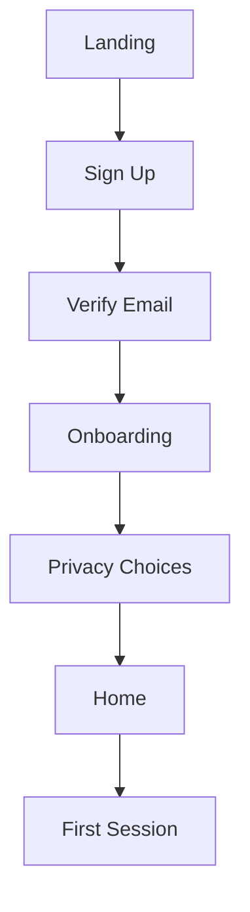

### Core Session Flow

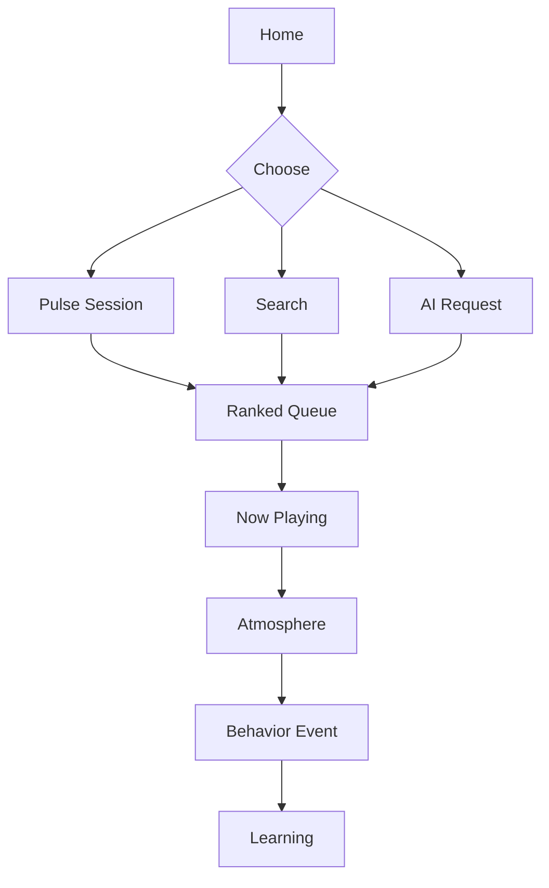

### Tape Flow

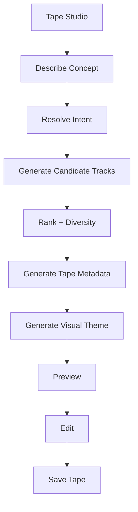

### SONORA Together Flow

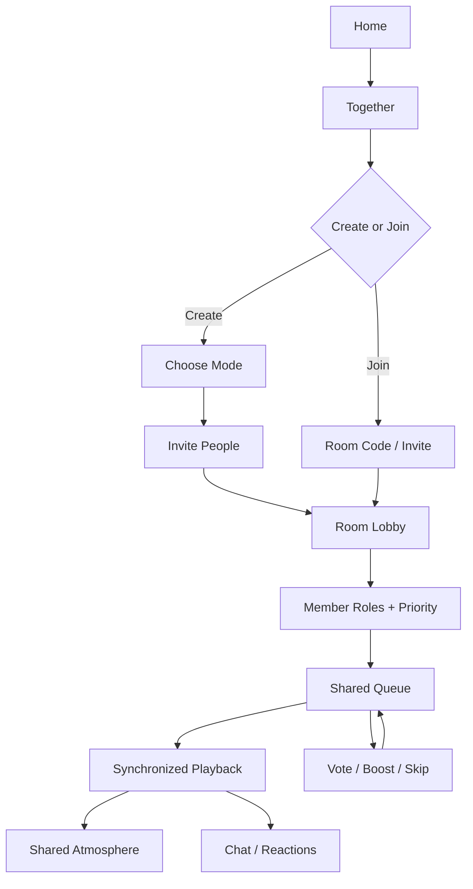

### Synchronized Playback Model

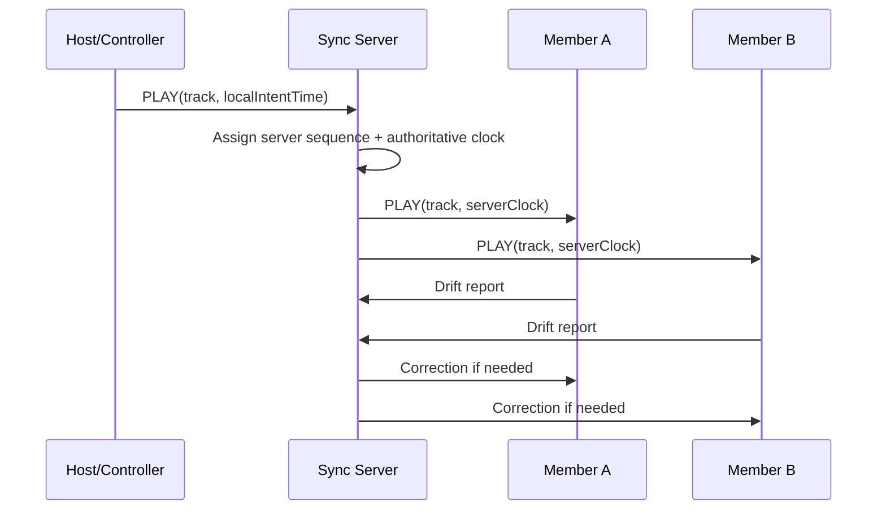

### Room Priority Flow


### Admin Flow

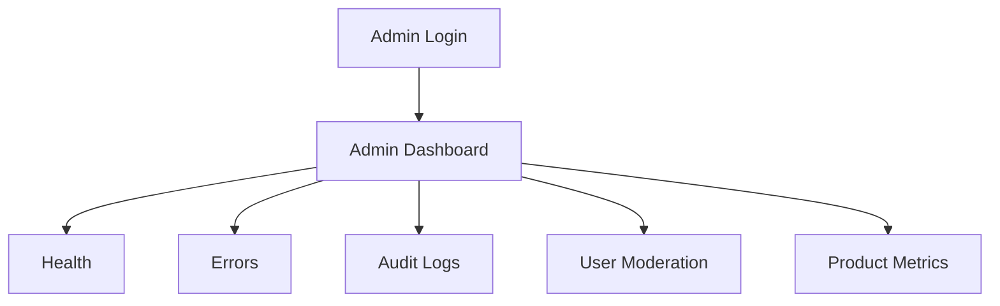

---

## 24. AI/ML Architecture

### AI Objective

AI should help SONORA:

- understand user intent
- personalize sessions
- explain recommendations
- create Tapes
- interpret memory requests
- generate theme configurations
- power conversational control

AI must not be responsible for everything.

Deterministic business logic should remain deterministic.

### AI Components

| Component | Purpose | Core Build |
|---|---|---|
| Intent Parser | Convert natural language to structured request | Optional/Low |
| Session Context Builder | Combine taste + time + preferences | Yes |
| Tape Generator | Generate concept/track candidate plan | Yes |
| Recommendation Explainer | Explain ranking | Yes |
| Atmosphere Generator | Create theme JSON | Yes |
| Memory Summarizer | Organize user-authored memory | Later |
| Conversation Agent | Multi-turn music assistant | 1.1 |

### Model Strategy

Use a provider abstraction:

```text
AIProvider
├── StructuredLLMProvider
├── EmbeddingProvider
└── OptionalLocalProvider
```

Do not hard-code the application to a single vendor-specific SDK throughout business logic.

### AI Input

Potential inputs:

- user request
- user preferences
- listening summaries
- recent session
- current time
- activity
- selected mood
- Music DNA
- candidate music metadata

Never send unnecessary personal data to an AI provider.

### AI Output

Prefer structured JSON for application actions.

Example:

```json
{
  "intent": "CREATE_SESSION",
  "mood": "nostalgic",
  "energy": 0.42,
  "durationMinutes": 60,
  "discoveryLevel": 0.2,
  "constraints": {
    "language": ["hi", "en"],
    "era": ["2000s", "2010s"]
  }
}
```

Validate the output before using it.

### Prompt Architecture

Use separate prompts for:

- intent extraction
- Tape generation
- theme generation
- explanation
- conversational response

Version prompts.

Example:

`/ai/prompts/theme/v1/system.md`

### Retrieval

Retrieve only the information required for the task.

For recommendation-related AI:

- compact taste summary
- selected history window
- current context

Do not dump entire listening history into the prompt.

### Embeddings

Use embeddings for:

- memory semantic search
- natural-language music preferences
- Tape concept matching
- optional music metadata similarity

### Vector DB

Start with `pgvector`.

Move to a dedicated vector database only if measured scale/query requirements justify it.

### RAG

Use RAG only where external knowledge is needed.

Examples:

- artist/song factual information
- personal memory retrieval

Do not use RAG for deterministic playback controls.

### Fine-Tuning

Not required for the current build stage.

Consider only after:

- collecting high-quality labeled examples
- identifying a stable narrow task
- measuring baseline model performance
- evaluating cost and maintenance

### Inference Strategy

- Structured outputs.
- Short prompts.
- Cache stable outputs.
- Stream conversational responses.
- Batch background processing when possible.
- Avoid AI calls for every UI interaction.

### Evaluation

Measure:

- recommendation acceptance
- skip rate
- replay rate
- session completion
- user corrections
- AI structured-output validity
- user rating/feedback
- latency
- token/cost usage

### Guardrails

- Validate all AI outputs.
- Do not let AI directly execute arbitrary backend actions.
- Use explicit tools/functions with authorization.
- Never allow AI to bypass ownership/security.
- Avoid exposing private memories to unrelated contexts.
- Add rate and budget limits.

### Cost Control

- Cache theme configurations.
- Cache explanations where valid.
- Summarize long history.
- Prefer deterministic ranking for ranking-heavy work.
- Use smaller models for classification/extraction.
- Use larger models only for high-value generation.

### Fallback

If AI is unavailable:

- Pulse still works through deterministic ranking.
- Atmosphere uses metadata/default mappings.
- Tape falls back to template-based curation where possible.
- Playback remains available.
- User sees a transparent degraded state.

### AI Request Flow

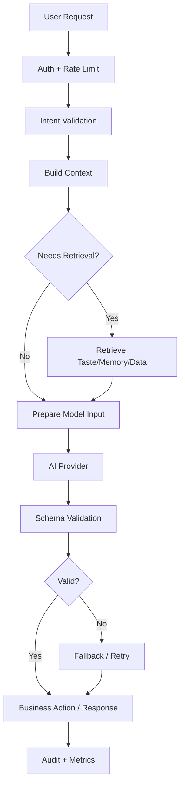

---


### AI Group Listening

For SONORA Together, AI must aggregate each participant's explicit preferences and room-level signals without exposing private history.

Inputs:
- room mode
- member-declared preferences
- permitted taste summaries
- current queue
- votes
- recent room playback
- discovery level

Outputs:
- next-track ranking
- transition suggestions
- group mood
- shared Atmosphere profile
- explanation such as `GROUP_FIT` or `MEMBER_TURN`

Private member history should remain private unless the member explicitly chooses to share a summary.

## 25. Data Flow

### Core Playback Data Flow

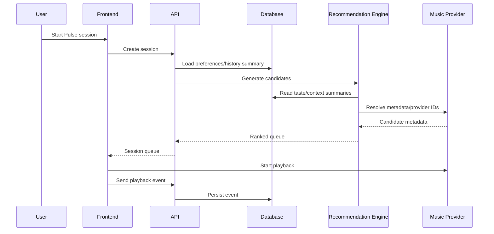

### AI Data Flow

```text
User message
→ intent parser
→ structured request
→ context builder
→ recommendation/metadata retrieval
→ AI generation (only where required)
→ output validation
→ product action
→ analytics
```

---

## 26. Business Logic

### Pulse Session Rules

Pulse should use weighted signals:

| Signal | Proposed Influence |
|---|---|
| Current context | High |
| Time-of-day pattern | High |
| Recent listening | High |
| Explicit preferences | High |
| Repeated behavior | Medium/High |
| Discovery level | Medium |
| Long-term taste | Medium |
| Popularity/trends | Low/Optional |

Exact weights must be validated with real usage.

### Familiar / Similar / Discovery Mix

Initial proposed mix:

- 50% Familiar
- 30% Similar
- 20% Discovery

This is a starting hypothesis, not a fixed truth.

### Repetition Rule

Do not immediately repeat recently played tracks unless:

- the user explicitly replays,
- the user has a strong repeated pattern,
- or the session context benefits from repetition.

### Skip Signal

Skipping is a negative signal, but context matters.

A single skip should not permanently reduce an artist/genre.

### Theme Rules

A theme can be influenced by:

- album art palette
- genre
- energy
- mood
- user theme preferences
- session type

Do not let AI generate arbitrary CSS.

AI outputs a constrained `ThemeSpec` that maps to a predefined design-token system.

### Tape Rules

A Tape must:

- have a concept,
- be playable,
- contain valid tracks,
- maintain diversity,
- avoid excessive repetition,
- preserve user constraints,
- clearly identify AI-generated metadata.

### Memory Rules

A memory:

- belongs to exactly one user,
- can reference one or more music items only if schema expands accordingly,
- is private by default,
- can be deleted,
- should not be exposed to other users unless explicitly shared.

### Decision Table: Personalization

| Condition | Action |
|---|---|
| Pulse disabled | Do not use time-based profile |
| Personalization disabled | Use explicit user preferences only |
| Private session | Do not update long-term taste |
| User skips repeatedly | Reduce near-term ranking weight |
| User replays repeatedly | Increase affinity cautiously |
| No history | Use onboarding/default preferences |
| AI unavailable | Use deterministic recommendation fallback |

---

## 27. State Management

### Global Client State

Use for:

- playback UI state
- mini-player state
- theme state
- drawer/modals
- session UI status

Recommended: Zustand.

### Local State

Use React local state for:

- form fields
- temporary UI controls
- dialogs
- ephemeral interactions

### Server State

Use TanStack Query for:

- profile
- playlists
- tapes
- memories
- recommendations
- Music DNA

### Persistent State

Database:

- user profile
- preferences
- memories
- tapes
- listening summaries

Local browser:

- non-sensitive UI preferences
- recently viewed UI state

### Cache

Redis:

- recommendation/session caches
- rate limiting
- temporary AI request results
- provider response caching where permitted

---

## 28. Error Handling

### Standard Response

```json
{
  "success": false,
  "error": {
    "code": "ERROR_CODE",
    "message": "Human readable message",
    "requestId": "trace-id"
  }
}
```

Never return stack traces to end users.

### Error Categories

| Category | Strategy |
|---|---|
| Client validation | Inline errors |
| Auth | Generic safe auth message |
| Rate limit | 429 + retry information |
| Provider failure | Retry/fallback |
| AI failure | Deterministic fallback where possible |
| Database failure | Log + generic message |
| Network failure | Retry with exponential backoff |
| Timeout | Abort + retry only where safe |
| Unknown | Error tracking + generic message |

### Retry Strategy

Use exponential backoff with jitter for transient errors.

Do not retry:

- invalid requests
- authentication failures
- deterministic validation errors

Use idempotency keys for operations where duplicated retries could create duplicates.

---

## 29. Validation Rules

### Account

- Email must follow validated email format.
- Password must meet configured minimum strength.
- Display name should have sensible length limits.

### Text

- Reject oversized payloads.
- Trim whitespace.
- Normalize where appropriate.

### Numeric

- Non-negative duration.
- Bounded discovery levels.
- Bounded theme intensity.

### File

- Approved MIME types.
- Maximum file size.
- Safe names.
- Virus scan where required.

### Security

- Reject unsupported content types.
- Validate JSON schema.
- Prevent mass assignment by using explicit DTOs.

### Business

- User can modify only owned resources.
- Deleted resources cannot be mutated.
- Private memories remain private.
- Disabled personalization cannot update long-term personalization state.

---

## 30. Performance Strategy

### Frontend

- Code splitting.
- Route-based lazy loading.
- Optimize images.
- Preload only essential assets.
- Memoize expensive visual components carefully.
- Avoid re-rendering the entire player when a single state changes.
- Use Web Workers for non-trivial client-side computations if measured necessary.

### Backend

- Typed DTOs.
- Efficient SQL queries.
- Pagination.
- Avoid N+1 queries.
- Cache stable provider metadata.

### Database

- Index measured access patterns.
- Avoid storing large blobs in relational tables.
- Aggregate raw event streams.
- Use pagination for history.

### Caching

Cache:

- music metadata
- generated themes
- stable recommendation context
- public marketing content

Do not cache private user data without correct key isolation.

### Audio/Visualizer

- Keep visualization decoupled from playback-critical thread.
- Throttle visual updates where needed.
- Respect reduced-motion preferences.
- Pause visual effects when the page is hidden when possible.

### Proposed Performance Targets

| Metric | Core Build Target |
|---|---|
| First meaningful UI | < 2.5 sec on representative broadband target |
| Common API p95 | < 500 ms |
| AI session generation | < 5 sec target |
| Search response | < 1 sec target excluding slow provider APIs |
| Visual theme switch | < 250 ms perceived transition |
| E2E player control | < 100 ms target for local UI feedback |

Targets must be benchmarked on representative devices.

---

## 31. Scalability Strategy

### 100 Users

- One app deployment.
- Managed Postgres.
- Basic Redis.
- Minimal observability.
- Single AI provider.

### 1,000 Users

- Proper indexes.
- Redis caching.
- Background jobs for analytics/AI enrichment.
- CDN for assets.
- Better rate limiting.
- Basic autoscaling.

### 10,000 Users

- Multiple API instances.
- Worker process.
- Queue for non-blocking jobs.
- DB connection pooling.
- More aggressive caching.
- AI cost budgets.
- Search optimization.

### 100,000+ Users

Potential components:

- load balancer
- horizontally scaled API
- dedicated worker fleet
- queue infrastructure
- read replicas
- analytics warehouse
- dedicated recommendation pipeline
- separate vector/search layer
- object CDN
- service boundaries based on measured load/team ownership

### Microservices Rule

Do not introduce a microservice because it “looks enterprise.”

Introduce one when:

- a module has independent scaling needs,
- independent deployment is valuable,
- team ownership justifies it,
- operational overhead is justified.

---

## 32. Testing Strategy

### Unit Testing

Tools:

- Vitest/Jest.

Test:

- ranking functions
- time-of-day logic
- theme mapping
- permission checks
- validation
- Tape ordering
- Pulse calculations

Example cases:

- same user/session context yields deterministic ranking when expected
- private sessions do not update long-term taste
- disabled Pulse does not read Pulse profile

### Integration Testing

Test:

- API + DB
- auth flows
- recommendation persistence
- memory creation
- Tape generation persistence

### API Testing

Use contract-based tests:

- auth
- validation
- status codes
- authorization
- rate limits

### Component Testing

Test:

- player controls
- theme transitions
- Tape editor
- memory form
- settings

### E2E Testing

Use Playwright.

Critical flows:

1. Register
2. Onboard
3. Search
4. Play
5. Generate session
6. Add memory
7. Create Tape
8. Change Atmosphere
9. Logout/login

### Security Testing

- dependency audit
- auth abuse tests
- authorization tests
- XSS payload tests
- upload tests
- rate-limit tests
- secret scanning

### Performance Testing

Use k6 or equivalent.

Measure:

- search
- session generation
- playback event ingestion
- memory API
- Tape generation rate limits

---

## 33. QA Acceptance Criteria

### Project-Level

The product is acceptable for its release gate when:

- Users can register/login.
- Users can search authorized music.
- Users can play supported music.
- Queue works.
- Pulse can produce context-aware sessions.
- Atmosphere changes safely.
- Tape generation works within defined scope.
- Memories are private and retrievable.
- Personalization can be disabled.
- Core APIs are validated.
- Critical test suite passes.
- No critical security issue remains.
- Production deployment succeeds.
- Monitoring captures server/client failures.

### Feature Example: Pulse

Acceptance:

- User can enable/disable Pulse.
- Pulse uses timestamps only when consent/settings permit.
- Session generation works even when history is empty.
- Private session does not modify long-term profile.
- Recommendations contain a traceable reason code.

---

## 34. Deployment Architecture

### Environments

```text
Local
  ↓
Development
  ↓
Staging
  ↓
Production
```

### Deployment

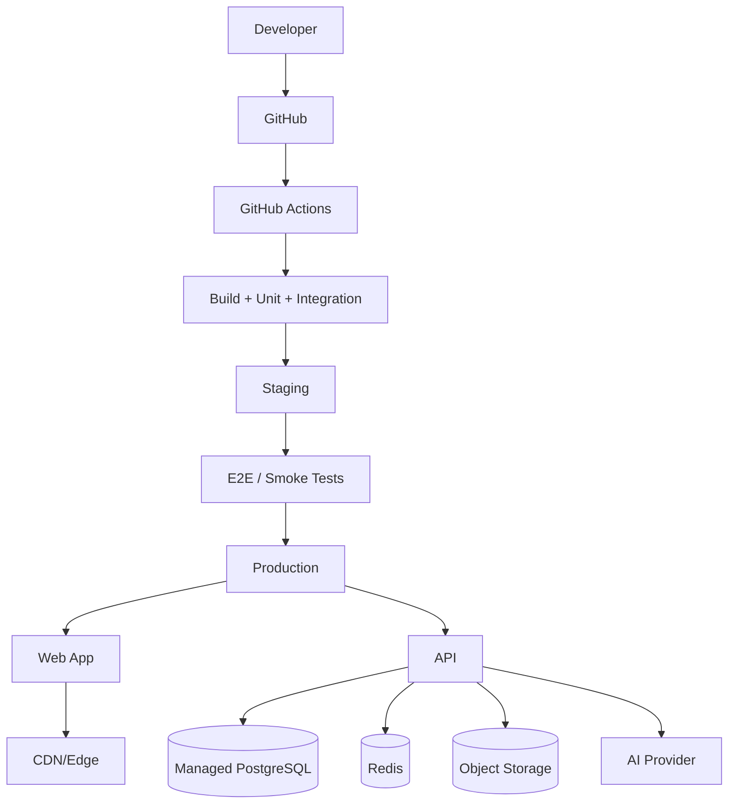

### Development

- Docker Compose for local DB/Redis.
- `.env.local`.
- Seed data.
- Mock provider where possible.

### Staging

- Separate DB.
- Test AI credentials.
- Test music adapter/provider.
- Production-like configuration.

### Production

- Managed DB.
- Secure secrets.
- TLS.
- backups.
- monitoring.
- alerts.

### Backups

- Automated DB backups.
- Restore test periodically.
- Object storage versioning where needed.

### Domain

Use a custom domain after the first release validation gate.

### SSL

HTTPS required in production.

---

## 35. Environment Variables

Example `.env.example`:

```env
NODE_ENV=development

DATABASE_URL=
REDIS_URL=

APP_URL=
API_URL=

AUTH_SECRET=
SESSION_SECRET=

MUSIC_PROVIDER_CLIENT_ID=
MUSIC_PROVIDER_CLIENT_SECRET=

AI_PROVIDER_API_KEY=
AI_MODEL=
EMBEDDING_MODEL=

OBJECT_STORAGE_ENDPOINT=
OBJECT_STORAGE_BUCKET=
OBJECT_STORAGE_ACCESS_KEY=
OBJECT_STORAGE_SECRET_KEY=

ERROR_TRACKING_DSN=
ANALYTICS_KEY=

EMAIL_PROVIDER_API_KEY=
EMAIL_FROM=
```

### Variable Explanation

| Variable | Purpose |
|---|---|
| `DATABASE_URL` | PostgreSQL connection |
| `REDIS_URL` | Redis connection |
| `AUTH_SECRET` | Authentication cryptographic secret if architecture requires |
| `MUSIC_PROVIDER_*` | Authorized provider integration |
| `AI_PROVIDER_API_KEY` | AI provider credential |
| `AI_MODEL` | Selected model identifier |
| `EMBEDDING_MODEL` | Embedding configuration |
| `OBJECT_STORAGE_*` | Asset storage |
| `ERROR_TRACKING_DSN` | Error reporting |
| `ANALYTICS_KEY` | Product analytics |
| `EMAIL_*` | Email delivery |

Never place real values in the repository.

---

## 36. Git & GitHub Strategy

### Repository Strategy

Recommended: monorepo.

### Branches

- `main`
- `develop`
- `feature/*`
- `bugfix/*`
- `hotfix/*`

For a solo developer, `main` + short-lived feature branches can be simpler.

### Commit Convention

Use:

- `feat:`
- `fix:`
- `docs:`
- `refactor:`
- `test:`
- `chore:`
- `perf:`
- `security:`

Examples:

`feat: add pulse session generation`

`fix: prevent duplicate tape items`

### Pull Request Rules

Every PR should include:

- Summary
- Why
- Screenshots for UI
- Test evidence
- Breaking-change note if applicable

### Issue Template

Include:

- problem
- reproduction
- expected
- actual
- environment
- screenshots/logs

### Release Strategy

Use semantic versions:

`0.1.0` → architecture/development baseline  
`0.2.0` → significant feature  
`1.0.0` → production baseline

---

## 37. Development Roadmap

The product is built as one continuous **60-day production candidate**. Work is organized by capability and dependency, not by “frontend first, backend later”. Every vertical slice moves UI, API, database, integration, validation, and tests together.

### Phase 0 — Research, Resource & Architecture Gate (Days 1–3)

- Validate problem, product boundaries, music-provider model, AI provider strategy, and legal/licensing assumptions.
- Inventory images, icons, fonts, audio samples, APIs, SDKs, models, storage, email, analytics, and monitoring dependencies.
- Lock system architecture, database model, API contracts, threat model baseline, observability plan, and Git workflow.

### Phase 1 — Product Shell & Design System (Days 4–8)

- Build the responsive application shell, navigation, dashboard surfaces, player shell, design tokens, responsive behavior, accessibility foundation, and Atmosphere prototype.
- Establish reusable components, loading/empty/error states, motion controls, and frontend testing patterns.

### Phase 2 — Platform Foundation: Database, Backend & Auth (Days 9–14)

- Implement PostgreSQL/Prisma foundation, NestJS modules, validation, structured logging, health/readiness endpoints, authentication, session management, ownership checks, privacy settings, and migration/seed strategy.

### Phase 3 — Music Core & Learning Signals (Days 15–23)

- Implement the authorized music provider adapter, search, playback, queue, listening events, telemetry contracts, and the first reliable user-to-database listening loop.

### Phase 4 — Personalization & Atmosphere (Days 24–32)

- Implement Pulse, candidate generation, ranking, one-tap sessions, Adaptive Atmosphere, transitions, controlled discovery, and recommendation explanations.

### Phase 5 — Personal Intelligence & AI (Days 33–45)

- Implement Music DNA, Why This Song, Tape Studio, Memory, natural-language AI DJ, song intelligence, taste timeline, and shareable artifacts with privacy-safe rendering.

### Phase 6 — SONORA Together & Social (Days 46–59)

- Implement rooms, membership, roles, presence, authoritative playback clock, synchronized playback, group queue/fairness, votes, shared Atmosphere, reactions, private messaging, E2EE using an established audited protocol/library, Couple/Family modes, Dual Tape, Song Universe, Time Machine, Music Adventure, and creator profiles.

### Phase 7 — Release Engineering & Launch Candidate (Days 52–60, overlapping with Phase 6)

- Expand unit/integration/E2E coverage, security testing, abuse controls, accessibility verification, performance profiling, cost checks, backups, restore drills, staging, production deployment, monitoring, rollback validation, documentation, demo assets, and launch checklist.

### Critical Path

`Music provider authorization → playback adapter → event schema → Pulse → ranking/session engine → Atmosphere integration`

and

`Realtime foundation → authoritative clock → sync recovery → room queue/permissions → Together interactions`

A delay on either path triggers roadmap recalculation rather than silent schedule compression.

---

## 38. 60-Day Full Project Build Plan

### Daily working pattern

Every implementation day uses the same vertical-slice contract:

- **Product:** exact user capability being completed.
- **Frontend:** screens, components, state, validation, loading/empty/error behavior.
- **Backend:** endpoint/service/business logic.
- **Database:** schema, migration, indexes, queries.
- **Integration:** browser → API → database/provider/realtime path.
- **QA/Security:** tests, authorization, abuse/failure cases.
- **DevOps/Docs:** logs, environment, CI, deployment, API/schema documentation as needed.

### Days 1–15 — Foundation + Platform Core

| Day | Goal | Frontend | Backend | Database | Integration | QA / Security | Deliverable |
|---|---|---|---|---|---|---|---|
| 1 | Repo + operating contract | App workspace + routing skeleton | API skeleton + config | DB project + migration tooling | Local end-to-end boot | Lint/typecheck + CI seed | Clean monorepo starts locally |
| 2 | Architecture baseline | Route map + UI composition map | Module boundaries + error contract | ERD + initial schema draft | Contract review | ADRs + threat-model baseline | Architecture pack |
| 3 | Resource readiness | Asset placeholders + font loading strategy | Provider/AI adapter interfaces | Resource/config tables where needed | Verify APIs/SDKs/accounts | License/terms inventory | Resource readiness gate |
| 4 | Design system | Tokens, typography, spacing, responsive grid | Theme configuration contract | N/A | Shared component contract | Accessibility baseline | Reusable UI system |
| 5 | Application shell | Navigation, layouts, dashboard shell | Protected route middleware skeleton | User/settings schema draft | Route guards | E2E smoke path | Responsive app shell |
| 6 | Player shell | Mini/full player, controls, progress | Playback state DTOs | Playback/session state tables draft | State synchronization | Keyboard/focus tests | Interactive player shell |
| 7 | Backend foundation | API error/loading adapters | NestJS modules, validation, logging, health | Connection + migration verification | Frontend API client | CI runs build/type/test | Operational API foundation |
| 8 | Database foundation | User-facing states for persisted data | Repository/service patterns | Core user, preference, session tables | Clean DB bootstrap | Migration rollback test | DB foundation |
| 9 | Registration | Signup UI + validation | Registration endpoint + hashing | Users + constraints/indexes | Browser → API → DB | Duplicate email + validation tests | Real registration |
| 10 | Login/session | Login UI + session store | Login/logout/session strategy | Session/token records if needed | Protected route test | Invalid/expired session tests | Real authenticated session |
| 11 | Password recovery | Recovery/request UI | Reset flow + token lifecycle | Reset-token records | Email/provider sandbox | Token expiry + abuse controls | Recovery flow |
| 12 | Onboarding | Preference onboarding | Preference APIs | Preference tables/relations | Persist preferences | Consent/privacy tests | First-run profile |
| 13 | Privacy controls | Settings screens | Enforcement middleware/services | Privacy flags/history controls | Verify every dependent feature reads settings | Access-control tests | Privacy baseline |
| 14 | API contract hardening | Typed client generation/use | OpenAPI contract + consistent errors | Constraint review | Contract test | CI contract validation | Stable API contract |
| 15 | Provider gate | Search/player integration states | Provider adapter skeleton | Provider metadata schema | Sandbox/provider connection | Quota/failure handling | Authorized provider connected |

### Days 16–30 — Music Core + Personalization

| Day | Goal | Frontend | Backend | Database | Integration | QA / Security | Deliverable |
|---|---|---|---|---|---|---|---|
| 16 | Search | Search screen, results, artist/track cards | Search endpoint + mapping | Cached metadata strategy | Provider → API → UI | Query validation + provider failure tests | Real search |
| 17 | Track detail | Detail surface + actions | Track metadata endpoint | Track metadata persistence/cache | Detail → play/save | Empty/error tests | Track exploration |
| 18 | Playback adapter | Real play/pause/seek/next | Provider playback service | Playback session state | Provider → player | Playback failure/retry tests | Real playback path |
| 19 | Queue core | Queue drawer, reorder/remove | Queue commands | Queue items/order | UI ↔ API ↔ player | Race-condition tests | Persistent queue |
| 20 | Save library | Save/unsave UX | Library APIs | Saved tracks/playlists | Persistence end-to-end | Ownership tests | Personal library |
| 21 | Event pipeline | Event capture hooks | Event ingestion/normalization | Listening events + indexes | Play/skip/replay/save events | Duplicate/idempotency tests | Reliable behavior data |
| 22 | Event aggregation | History views/states | Feature aggregation jobs/services | Aggregation tables | Raw → features | Data-quality checks | Usable listening signals |
| 23 | Pulse v1 | Context/session cards | Pulse feature extraction | Pulse summaries | Time/context → API → UI | Privacy + aggregation tests | First Pulse model |
| 24 | Candidate generation | Session preview UI | Candidate retrieval | Candidate/ranking inputs | History → candidates | Repeat/blocked-item tests | Candidate pool |
| 25 | Ranking engine | Recommendation controls | Transparent scoring/ranking | Ranking features/weights | Rank → session | Determinism/regression tests | Explainable ranking core |
| 26 | Session generation | One-tap session flow | Session generator service | Session records | Pulse + rank → queue | Timeout/fallback tests | Personalized session |
| 27 | Feedback loop | Like/skip/save feedback UI | Feedback endpoint + feature update | Feedback events | Feedback → rank features | Authorization/idempotency tests | Learning loop |
| 28 | Atmosphere model | Theme renderer | Atmosphere resolver | Theme preferences/specs | Track metadata/audio → theme | Reduced-motion/accessibility tests | Adaptive theme engine |
| 29 | Atmosphere motion | Transitions, particles, visualizer | Theme state API if needed | N/A | Playback ↔ visual state | Performance budget checks | Living player visuals |
| 30 | Core integration gate | Full main journey polish | Trace main APIs | Clean migration | Auth → search → play → learn → session | Full smoke + regression | First complete product loop |

### Days 31–45 — Intelligence + AI + Personal Artifacts

| Day | Goal | Frontend | Backend | Database | Integration | QA / Security | Deliverable |
|---|---|---|---|---|---|---|---|
| 31 | Music DNA model | Taste dashboard | Aggregation/profile service | DNA profile + versioning | Events → DNA | Data confidence checks | Music DNA |
| 32 | DNA visual language | Charts/cards/insights | Insight DTOs | Cached insight snapshots | DNA → UI | Accessibility + empty-state tests | Taste visualization |
| 33 | Why This Song | Explanation UI | Reason-code/rationale service | Recommendation signals | Rank → explanation | No unsupported claims rule | Explainable recommendations |
| 34 | Surprise Me | Discovery controls | Novelty/familiarity scoring | Discovery feedback | Discover → play → feedback | Avoid-repeat tests | Controlled discovery |
| 35 | Memory foundation | Memory composer UI | Memory CRUD + ownership | Memories + song relations | Save/retrieve/delete | Privacy and object-level auth | Memory system |
| 36 | Memory timeline | Timeline/revisit UI | Timeline query service | Timeline indexes | Memory + listening history | Pagination/query tests | Personal music timeline |
| 37 | Tape intent | Tape Studio prompt/inputs | Intent parser + structured schema | Tape + item models | Intent → candidate request | Schema validation | Tape concept pipeline |
| 38 | Tape ranking | Track selection/editor | Tape ranking/generation | Tape items/order | AI + ranking → Tape | Determinism + fallback | Generated Tape |
| 39 | Tape visual identity | Cover/theme editor | Metadata/asset service | Tape artwork metadata | Storage → Tape UI | Asset/license checks | Finished Tape artifact |
| 40 | Natural-language AI DJ | Chat/DJ UI | AI orchestration + tool calls | Conversation/session logs where needed | User intent → session actions | Prompt injection + auth tests | AI DJ foundation |
| 41 | Song intelligence | Song insight surface | Metadata explanation service | Cached metadata/insights | Provider metadata → AI/logic | Source/claim validation | Song intelligence |
| 42 | AI reliability pass | Loading/streaming/fallback UX | Structured outputs, retry/budget controls | AI usage telemetry | Provider failure fallback | Hallucination/safety tests | Reliable AI layer |
| 43 | Taste timeline | Time-based taste exploration | Timeline aggregation | Time buckets/features | DNA + history | Query performance tests | Taste evolution view |
| 44 | Shareable identity | Public-safe card UI | Public artifact renderer | Share-safe snapshots | Artifact → share route | Privacy leakage tests | Identity cards |
| 45 | Intelligence gate | Cross-feature polish | Cross-module integration | Consistency review | Core + AI end-to-end | Regression/security suite | Personal intelligence release candidate |

### Days 46–60 — Together + Social + Production Hardening

| Day | Goal | Frontend | Backend | Database | Integration | QA / Security | Deliverable |
|---|---|---|---|---|---|---|---|
| 46 | Together architecture | Room/lobby UX skeleton | Realtime gateway + event contract | Rooms/members schema | WebSocket handshake | Threat model update | Together foundation |
| 47 | Membership + roles | Invite/join/member UI | Room permissions/role checks | Membership constraints | Auth → room access | Object access + invite abuse tests | Private rooms |
| 48 | Presence | Online/member states | Presence service | Presence/session records if needed | Realtime presence | Disconnect/reconnect tests | Reliable room presence |
| 49 | Authoritative clock | Sync indicators | Server playback clock | Playback checkpoints | Client drift calculation | Clock tamper/reconnect tests | Sync engine |
| 50 | Synchronized playback | Shared player state | Sync/reconciliation service | Room playback state | Multi-client playback | Two-client drift tests | Shared playback |
| 51 | Group queue | Queue UI + member controls | Group queue service | Room queue/vote tables | Playback ↔ room queue | Race/fairness tests | Group queue |
| 52 | Voting/fairness | Votes/priorities UI | Fairness/ranking engine | Votes/history | Vote → rank → queue | Abuse/spam limits | Fair group selection |
| 53 | Shared Atmosphere | Room visual state | Theme broadcast | Shared atmosphere settings | Playback → theme → room | Network drop recovery | Shared Atmosphere |
| 54 | Reactions/comments | Reaction/comment UI | Event transport | Time-linked reactions | Realtime events | Content/rate moderation | Room reactions |
| 55 | Private messaging | Chat UX | Secure message transport | Message metadata/state | Room-specific messaging | Privacy/threat tests | Private room chat |
| 56 | E2EE gate | Key/device UX where needed | Audited E2EE library integration | Key metadata as required | Encrypt/decrypt multi-client | Key lifecycle/revocation tests | E2EE candidate implementation |
| 57 | Couple/Family + moderation | Mode-specific UI | Moderation/role policies | Mode/settings fields | Policy enforcement | Abuse/report/block tests | Social modes |
| 58 | Dual Tape + Song Universe | Shared Tape/graph UI | Shared artifact + graph services | Relationships/graph data | Music → relationship graph | Privacy + query tests | Social discovery layer |
| 59 | Time Machine + Adventure + creator | Timeline/adventure/profile UI | Aggregation/public profile services | Time buckets/public artifacts | Personal history → discovery | Performance/accessibility | Full social surface |
| 60 | Final release gate | Full UX polish + demo flows | Production config + rollback hooks | Backup/restore verification | Staging → production | Full test/security/accessibility/performance sweep | Production candidate |

## 38.1 Weekly Integration Gates

### Gate A — Day 7
Foundation is reproducible on a clean machine.

### Gate B — Day 14
Authentication, onboarding, privacy, database and API contracts are stable.

### Gate C — Day 21
Search, playback, queue, save and events work with real provider integration.

### Gate D — Day 30
The main product loop works end-to-end: context → session → playback → learning → better next session.

### Gate E — Day 45
Personalization, AI, Memory, Tape and intelligence features are integrated without critical blockers.

### Gate F — Day 52
Together rooms, sync, permissions, queue fairness and realtime recovery meet test criteria.

### Gate G — Day 60
Production candidate passes release, recovery, security, accessibility, observability, and performance gates.

At each gate choose only one: `CONTINUE` / `REPLAN` / `REDUCE SCOPE` / `PAUSE`.

## 38.2 Daily Definition of Done

A day is complete only when applicable:

- [ ] user-facing behavior works,
- [ ] backend behavior works,
- [ ] database migration/query path works,
- [ ] API contract matches actual client usage,
- [ ] validation and authorization exist,
- [ ] loading/empty/error states are handled,
- [ ] tests/checks pass,
- [ ] integration is verified against real dependencies where available,
- [ ] documentation/status is updated,
- [ ] no critical known blocker is silently hidden.

## 39. Milestones

| Milestone | Goal | Exit Criteria |
|---|---|---|
| M0 | Research & Resource Gate | Evidence, requirements, provider/legal assumptions, resources and risk register documented |
| M1 | Foundation Complete | Repository, architecture, UI system, API/DB foundations and CI operational |
| M2 | Platform Complete | Auth, onboarding, privacy and core data paths work end-to-end |
| M3 | Music Core Complete | Search, playback, queue, saves and event ingestion work with authorized music access |
| M4 | Personalization Complete | Pulse, ranking, sessions and Adaptive Atmosphere work together |
| M5 | Intelligence Complete | DNA, explanations, discovery, Memory, Tape and AI DJ integrated |
| M6 | Together Complete | Rooms, synchronized playback, permissions, fairness and shared Atmosphere work |
| M7 | Social + Security Complete | Messaging, moderation, social artifacts and E2EE candidate pass their gates |
| M8 | Production Hardening Complete | Test coverage, security, performance, monitoring, backup/recovery and rollback verified |
| M9 | Launch Candidate | Staging/production configuration, docs, demo, legal/provider checks and release checklist complete |

## 40. Risk Analysis

| Risk | Probability | Impact | Mitigation |
|---|---|---|---|
| Music provider/licensing constraints | High | Very High | Resolve provider/licensing model before implementation; use adapter |
| AI costs | Medium | High | Caching, small models, budgets, deterministic logic |
| Recommendation quality | High | High | Start with transparent heuristics and evaluate |
| AI hallucination | Medium | Medium | Structured outputs, provider metadata, citations for knowledge features |
| Theme performance | Medium | Medium | CSS-first, optimized visualizers, reduced motion |
| Scope creep | High | High | Protect the committed scope and enforce the roadmap |
| Privacy concerns | Medium | Very High | Explicit consent/settings and data minimization |
| Third-party outage | Medium | High | Provider adapters and fallbacks |
| Student timeline | High | High | Modular architecture; defer only items outside the committed 60-day scope |
| Database event growth | Medium | Medium | Aggregation/retention strategy |
| Account security | Medium | Very High | Secure auth, rate limits, testing |
| Mobile performance | Medium | High | Progressive visual complexity |

---

## 41. Cost Estimation

> Exact vendor pricing is dynamic and must be verified immediately before choosing a production provider.

### Free-Tier / Prototype Approach

Potentially use:

- local development
- free/low-cost Postgres tier
- free/low-cost Redis tier if available
- free CI minutes within provider limits
- low-volume analytics/error tracking
- limited AI credits
- royalty-free/demo music or authorized provider APIs

Primary cost risk:

**AI + music access/licensing + storage/bandwidth.**

### Low-Budget Approach

Target:

- one frontend deployment
- one backend deployment
- managed Postgres
- Redis
- small object storage
- controlled AI usage
- one authorized music integration

### Scaled Production Approach

Costs may come from:

- music rights/licensing or provider fees
- bandwidth
- storage
- AI inference
- recommendation infrastructure
- database
- observability
- customer support

Do not commit to a business model until provider contracts and user economics are understood.

---

## 42. Monitoring & Observability

### Logs

Structured logs should include:

- timestamp
- level
- service
- request ID
- user ID hash/reference where appropriate
- route
- latency
- status
- error code

Avoid logging private memories, auth tokens, or raw sensitive prompts.

### Metrics

Track:

- API p50/p95/p99
- error rate
- AI latency
- AI failure rate
- provider failure rate
- recommendation generation time
- DB latency
- queue processing time

### Health Checks

- `/health`
- `/ready`
- dependency checks where safe

### Error Tracking

Capture:

- frontend exceptions
- backend exceptions
- provider integration errors
- AI schema errors

### Alerts

Alert on:

- elevated error rate
- database failures
- provider outage
- AI failure spike
- abnormal latency
- storage issues

### Product KPIs

- Activation rate
- D1/D7/D30 retention
- sessions/user/week
- average listening session duration
- Pulse session start rate
- Tape creation rate
- memory creation rate
- recommendation acceptance rate
- recommendation skip rate
- atmosphere usage
- Surprise Me usage

---

## 43. Analytics

### Activation

Definition proposal:

> User completes onboarding and plays at least one supported track in the first session.

### Retention

- D1
- D7
- D30

### Engagement

- sessions per user
- completed tracks/session
- replays
- saves
- Tapes created
- Memories created

### AI Quality

- AI request success
- AI correction rate
- recommendation accept/skip ratio
- theme override ratio
- Tape edit rate after generation

### Key Product Question

The most important metric is not raw session length.

Ask:

> **Does SONORA increase the probability that a user returns for another meaningful session?**

---

## 44. SEO Strategy

Applicable mainly to public web pages.

### Metadata

Every public route should have:

- title
- description
- Open Graph
- Twitter/X card where useful

### Sitemap

Generate a sitemap for public pages.

### Robots

Do not index private app routes unless deliberately designed for discovery.

### Structured Data

Possible:

- SoftwareApplication
- WebSite
- Organization

Only where accurate.

### Canonical URLs

Use canonical URLs on public marketing/content routes.

### Core Web Vitals

Monitor:

- LCP
- CLS
- INP

### Search-Friendly Routes

Examples:

- `/`
- `/about`
- `/features`
- `/security`
- `/privacy`

Public Tape pages can be considered later only after privacy/sharing is fully designed.

---

## 45. Accessibility

Requirements:

- Keyboard navigation.
- Visible focus.
- Semantic buttons.
- Accessible names for icon buttons.
- Screen-reader labels.
- Sufficient contrast.
- No color-only communication.
- Reduced motion.
- Captions/transcripts for AI voice where used.
- Form errors announced appropriately.
- Touch targets large enough for mobile.
- Focus trapping in dialogs where needed.

Do not make CRT effects the only way information is communicated.

---

## 46. Privacy & Data Handling

### Personal Data

Potential data:

- email
- profile data
- listening history
- playlists
- preferences
- memories
- AI interactions
- analytics

### Sensitive-ish Product Data

Memories and listening behavior can reveal personal habits.

Treat them as private product data even when not legally classified as sensitive under a particular law.

### Data Collection Principles

Collect only what is needed.

### Data Retention

Define retention for:

- raw playback events
- analytics
- AI conversations
- logs
- deleted resources

### Data Deletion

User should eventually be able to:

- delete account
- delete memories
- clear listening history
- reset taste profile
- disable personalization

### Data Export

Plan an export capability for:

- profile
- playlists
- tapes
- memories
- preference settings

### Third-Party Sharing

Only send required data to external AI/provider services.

Document external processors in privacy documentation.

Do not claim compliance with GDPR/DPDP/other laws without legal and jurisdiction-specific review.

---

## 47. Admin Panel

### Dashboard

- service health
- user totals
- active users
- error rate
- AI usage
- provider status

### User Management

- search users
- status
- role
- account actions
- audit trail

### Moderation

Applicable if public sharing is introduced.

### System Settings

- feature flags
- provider configuration
- AI limits
- emergency disable switches

### Logs

- audit logs
- integration errors
- suspicious activity

### Analytics

- activation
- retention
- Tape creation
- Memory creation
- feature adoption

Admin access must be tightly restricted.

---

## 48. Future Scope

### Near Future

- AI DJ
- better Pulse
- stronger Music DNA
- shareable Tapes
- better discovery controls

### Medium Term

- Dual Tape
- Song Universe
- Time Machine
- social listening rooms
- creator profiles

### Long Term

- mobile/desktop apps
- wearable/device context
- offline/local intelligence
- personal audio experiences
- richer multimodal interfaces

### Experimental

- voice-driven music world
- generative visual environments
- adaptive room/ambient simulation
- on-device taste models

---

## 49. Expansion Opportunities

### SaaS

Possible premium plan for:

- advanced AI sessions
- more memory storage
- enhanced Tapes
- advanced history/analytics

This needs validation; do not assume users will pay.

### Mobile App

React Native/Expo or platform-native.

### Desktop App

Tauri or similar lightweight desktop wrapper.

### API Platform

Potential APIs:

- Taste Profile API
- Atmosphere API
- Tape Generation API
- Music Memory API

### B2B

Potential future opportunities:

- music-tech experiences
- branded listening experiences
- creator tools
- wellness/study ambience experiences

### Marketplace

Only consider after strong creator demand exists.

---

## 50. Interview & Portfolio Value

### Engineering Skills Demonstrated

- Full-stack TypeScript.
- Next.js/React.
- NestJS.
- PostgreSQL.
- Redis.
- API design.
- Authentication.
- Authorization.
- Recommendation systems.
- AI orchestration.
- Vector search.
- Web Audio API.
- Real-time/async architecture if later added.
- Observability.
- Security.
- Testing.
- CI/CD.

### Engineering Concepts

Potential interview topics:

- Why PostgreSQL?
- Why modular monolith?
- How does Pulse work?
- How are recommendations ranked?
- How do you prevent repetitive recommendations?
- How does AI interact with deterministic logic?
- How do you prevent AI from bypassing authorization?
- How do you control AI costs?
- Why is pgvector used?
- How would you scale from 1K to 100K users?
- How are listening events modeled?
- How does theme generation remain safe?
- How do you handle provider failures?

### Resume Highlights

Focus on measurable results once they actually exist:

- latency improvements
- recommendation acceptance
- test coverage
- deployment reliability
- number of supported workflows

Never invent user counts or performance improvements.

### GitHub Showcase

README should prominently show:

- architecture
- screenshots
- key features
- demo
- technical decisions
- test strategy
- security model

### Demo Script

The strongest 2–3 minute demo:

1. Open SONORA.
2. Press **“Start My Session.”**
3. Show Pulse-generated queue.
4. Play track.
5. Show Atmosphere changing.
6. Open “Why this song?”
7. Create a Tape: “My 2026 college nights.”
8. Add a memory.
9. Open Music DNA.
10. Explain the feedback loop.

---

## 51. Resume Description

### One-line Version

**SONORA — AI-powered retro music platform that personalizes listening through context-aware recommendations, adaptive visual themes, music memory, and AI-generated mixtapes.**

### 2-line Version

**Built SONORA, an AI-native music player that learns time-based listening habits and personal taste to generate contextual sessions, adaptive audio-reactive themes, personalized Tapes, and song memories using a modular full-stack architecture.**

### ATS-friendly Bullet Points

- Built a full-stack AI music application using **Next.js, TypeScript, NestJS, PostgreSQL, Redis, and AI APIs**.
- Designed a **context-aware recommendation engine** combining time-of-day, listening behavior, explicit preferences, familiarity, similarity, and controlled discovery.
- Developed an **Adaptive Atmosphere engine** that transforms UI color, motion, texture, and visualizer behavior based on music context.
- Implemented **Music DNA, personal memories, and AI Tape generation** as differentiated personalization features.
- Designed secure REST APIs, authentication, authorization, validation, observability, testing, and deployment workflows.

Only claim implementation details that are actually completed.

---

## 52. GitHub README Outline

```text
# SONORA

## Overview
## Why SONORA?
## Problem
## Solution
## Features
## Product Demo
## Screenshots
## Adaptive Atmosphere
## Pulse
## Music DNA
## AI Tapes
## Music Memories
## Tech Stack
## Architecture
## Data Model
## API
## Installation
## Environment Variables
## Local Development
## Testing
## Deployment
## Security
## Roadmap
## Contributing
## License
## Author
```

---

## 53. Documentation Structure

```text
docs/
├── architecture/
│   ├── overview.md
│   ├── frontend.md
│   ├── backend.md
│   └── ai.md
├── api/
│   ├── authentication.md
│   ├── playback.md
│   ├── recommendations.md
│   ├── tapes.md
│   └── memories.md
├── database/
│   ├── schema.md
│   ├── migrations.md
│   └── indexing.md
├── ui-ux/
│   ├── design-system.md
│   ├── screens.md
│   └── accessibility.md
├── security/
│   ├── threat-model.md
│   └── checklist.md
├── deployment/
│   ├── development.md
│   ├── staging.md
│   └── production.md
├── testing/
│   ├── strategy.md
│   └── e2e.md
└── decisions/
    ├── ADR-001-stack.md
    ├── ADR-002-database.md
    ├── ADR-003-auth.md
    └── ADR-004-deployment.md
```

---

## 54. ADR List

### ADR-001 — Technology Stack

**Decision:** Next.js + TypeScript + NestJS + PostgreSQL + Redis.

**Reason:** Strong developer ecosystem, type safety, maintainability, and practical scalability.

### ADR-002 — Database Choice

**Decision:** PostgreSQL.

**Reason:** Relational product model, transaction support, strong indexing, mature tooling, and vector extension option.

### ADR-003 — Architecture Style

**Decision:** Modular monolith for the initial production architecture.

**Reason:** Reduces operational complexity while maintaining clear boundaries.

### ADR-004 — Authentication

**Decision:** Secure cookie/session-oriented browser authentication, with provider integration abstracted.

**Reason:** Protect browser credentials and simplify revocation.

### ADR-005 — API Versioning

**Decision:** `/api/v1`.

**Reason:** Provides a clear evolution path.

### ADR-006 — AI Provider Abstraction

**Decision:** AI access through application interfaces.

**Reason:** Models/vendors change rapidly and should not leak throughout business logic.

### ADR-007 — Vector Search

**Decision:** Start with pgvector.

**Reason:** Minimize infrastructure before scale requires a dedicated vector system.

### ADR-008 — Recommendation Architecture

**Decision:** Hybrid deterministic + AI-assisted design.

**Reason:** Ranking needs predictability, while AI adds interpretation and generation.

### ADR-009 — Music Provider Abstraction

**Decision:** Adapter interface for authorized providers/local content.

**Reason:** Music access/licensing is a changing external dependency.

### ADR-010 — Adaptive Theme

**Decision:** AI generates constrained ThemeSpec JSON, not arbitrary CSS/code.

**Reason:** Security, performance, and visual consistency.

---

## 55. Definition of Done

A feature is complete only when:

- [ ] Requirements understood
- [ ] Existing architecture inspected
- [ ] Implementation follows project structure
- [ ] Validation exists
- [ ] Authorization exists where required
- [ ] Error handling exists
- [ ] Loading/empty/error UI exists
- [ ] Responsive UI completed
- [ ] Accessibility considered
- [ ] Tests written for important logic
- [ ] Security implications checked
- [ ] Analytics added if appropriate
- [ ] Documentation updated
- [ ] Build passes
- [ ] Relevant E2E test passes
- [ ] No critical known bug remains
- [ ] Feature status updated

---

## 56. Final Pre-Coding / Build-Readiness Checklist

- [ ] Problem and user need defined
- [ ] Product positioning defined
- [ ] Full 60-day committed build scope defined
- [ ] Explicit experimental/excluded scope defined
- [ ] Provider/licensing model verified or explicitly marked pending
- [ ] AI provider/model strategy defined
- [ ] Resource/asset inventory completed
- [ ] Architecture designed
- [ ] Database designed
- [ ] API designed
- [ ] Authentication/authorization designed
- [ ] Privacy/data lifecycle designed
- [ ] Together realtime protocol and state model designed
- [ ] E2EE approach based on an established audited protocol/library
- [ ] UI/UX flows planned
- [ ] Security/threat model planned
- [ ] Testing strategy planned
- [ ] Deployment/rollback planned
- [ ] Monitoring/analytics planned
- [ ] 60-day day-wise roadmap created
- [ ] Git repository initialized
- [ ] Environment variables documented
- [ ] Legal/licensing assumptions flagged for verification
- [ ] Critical-path risks identified

## 57. Final Project Summary

### Project in One Sentence

**SONORA is an AI-native retro music machine that learns taste and listening rhythm, adapts its visual atmosphere to the music, turns meaningful listening into memories and mixtapes, and supports privacy-aware synchronized listening with trusted people.**

### Product Problem

Users have access to huge music catalogs but still spend effort deciding what to listen to, receive recommendations whose reasoning is hard to understand, and rarely connect listening history with personal memory or shared moments.

### Full Product Direction

The 60-day build covers:

- authenticated personal listening,
- authorized music search and playback,
- queue and saves,
- listening event ingestion,
- Pulse and personalized sessions,
- Adaptive Atmosphere,
- Music DNA and explanations,
- controlled discovery,
- Memory and Tape Studio,
- natural-language AI DJ and song intelligence,
- shareable identity artifacts,
- Together rooms,
- synchronized playback,
- fair group queues and voting,
- shared Atmosphere,
- reactions and private messaging,
- audited E2EE library/protocol integration,
- Couple and Family modes,
- Dual Tape, Song Universe, Time Machine, Music Adventure, creator profiles,
- testing, security, observability, backups, deployment and recovery.

### Tech Stack

- Next.js + React + TypeScript
- Tailwind CSS + accessible UI primitives
- Motion/Framer Motion where justified
- Zustand + TanStack Query
- NestJS + TypeScript
- PostgreSQL + Prisma + optional pgvector
- Redis where caching/rate-limiting/realtime support is justified
- S3-compatible object storage
- Provider-agnostic AI gateway
- Web Audio API; WebGL/Three.js only for meaningful visuals
- Vitest/Jest + Playwright
- OpenAPI
- Pino + Sentry/equivalent + PostHog/equivalent
- Docker + GitHub Actions

### Architecture

Modular monolith first, with explicit adapters for music providers and AI providers. Realtime room infrastructure is introduced as a focused subsystem only after the personal listening path is stable.

### Timeline

**60-day full project production-candidate build**, with explicit critical-path gates, weekly integration checks, security hardening, recovery testing, and deployment work included in the schedule.

### Biggest Risks

Music provider/licensing constraints, realtime synchronization, recommendation quality, AI cost/reliability, privacy, abuse/messaging security, and schedule compression on the critical path.

### Biggest Differentiator

**SONORA learns not only what you like, but when and why you listen—and changes the world around the music.**

## 58. AI CODING RULES

### Universal Rules

1. Read `PROJECT_MASTER.md` before coding.
2. Read relevant existing code before modifying anything.
3. Never modify architecture without documenting and justifying the reason.
4. Never create unnecessary features outside approved scope.
5. Follow the existing folder structure.
6. Follow established naming conventions.
7. Never hard-code secrets.
8. Never commit secrets.
9. Use environment variables for credentials/configuration.
10. Update documentation after major architecture changes.
11. Write tests for important business logic.
12. Explain breaking changes before implementation.
13. Do not overwrite working code blindly.
14. Inspect dependencies before adding new packages.
15. Verify builds after major changes.
16. Keep committed scope under control.
17. Ask for clarification only when a decision cannot reasonably be inferred from this document or repository context.
18. Maintain backward compatibility whenever practical.
19. Apply security thinking to every feature.
20. Never mark unfinished work as complete.
21. Do not remove working tests merely to make CI green.
22. Avoid duplicate utility logic when shared utilities already exist.
23. Prefer small, reversible changes.
24. Keep UI, business logic, and persistence boundaries clear.
25. Do not place provider-specific logic throughout the codebase; use adapters.
26. Do not allow AI output to directly bypass authorization.
27. Validate structured AI outputs.
28. Log failures safely without exposing secrets/private memories.
29. Respect privacy settings in all personalization features.
30. Update the relevant task/status after completion.

### AI Agent Workflow

Before modifying:

```text
1. Read PROJECT_MASTER.md
2. Inspect repository
3. Identify relevant module
4. Check dependencies
5. Check existing tests
6. Make smallest correct change
7. Run tests/build
8. Review security
9. Update documentation if needed
10. Report exactly what changed
```

### Prohibited AI Coding Behavior

- Inventing missing APIs.
- Assuming unsupported provider features.
- Hard-coding provider IDs without verification.
- Copying secrets into examples.
- Rewriting entire modules for tiny changes.
- Introducing microservices without justification.
- Adding libraries when native/existing solutions are sufficient.
- Claiming test success without running tests.
- Marking TODOs as complete.

---

## 59. Recommended Coding Order

1. Repository setup
2. `PROJECT_MASTER.md`
3. `.env.example`
4. Workspace/tooling
5. Design tokens/UI foundation
6. Database schema
7. Backend foundation
8. Authentication
9. Music provider abstraction
10. Search
11. Playback
12. Queue
13. Listening event ingestion
14. Pulse engine
15. Recommendation engine
16. Session generation
17. Adaptive Atmosphere
18. Music DNA
19. Why This Song
20. Memory
21. Tape generator
22. Privacy/settings
23. Testing
24. Security hardening
25. Performance optimization
26. Deployment
27. Monitoring
28. README/docs
29. Demo polish

### Important Dependency Rule

Do not build:

- advanced recommendation models before event schema exists,
- Music DNA before meaningful listening data exists,
- memory search before memory storage works,
- social features before user identity/privacy is stable,
- production scaling before measuring actual bottlenecks.

---

## 60. Final Master Task List

### EPIC-01 — Project Foundation

| ID | Description | Priority | Dependency | Complexity | Definition of Done |
|---|---|---|---|---|---|
| TASK-001 | Initialize monorepo | P0 | None | Low | Workspace installs/builds |
| TASK-002 | Add lint/format/typecheck | P0 | TASK-001 | Low | CI checks pass |
| TASK-003 | Add env management | P0 | TASK-001 | Low | `.env.example` available |
| TASK-004 | Add Docker local dependencies | P1 | TASK-001 | Medium | Local DB/Redis run |

### EPIC-02 — Architecture & Documentation

| ID | Description | Priority | Dependency | Complexity | Definition of Done |
|---|---|---|---|---|---|
| TASK-005 | Finalize architecture docs | P0 | TASK-001 | Medium | Docs reviewed |
| TASK-006 | Finalize API contracts | P0 | TASK-005 | Medium | OpenAPI baseline |
| TASK-007 | Create ADRs | P1 | TASK-005 | Low | ADR list committed |

### EPIC-03 — UI Foundation

| ID | Description | Priority | Dependency | Complexity | Definition of Done |
|---|---|---|---|---|---|
| TASK-008 | Design tokens | P0 | TASK-005 | Medium | Tokens implemented |
| TASK-009 | App shell | P0 | TASK-008 | Medium | Responsive shell |
| TASK-010 | Player components | P0 | TASK-009 | High | Player interactions work |
| TASK-011 | Theme system | P0 | TASK-008 | High | ThemeSpec renders safely |

### EPIC-04 — Backend Foundation

| ID | Description | Priority | Dependency | Complexity | Definition of Done |
|---|---|---|---|---|---|
| TASK-012 | NestJS setup | P0 | TASK-001 | Low | API runs |
| TASK-013 | Validation/error middleware | P0 | TASK-012 | Medium | Errors standardized |
| TASK-014 | Logging/tracing | P1 | TASK-012 | Medium | Structured logs |
| TASK-015 | Health checks | P0 | TASK-012 | Low | Health endpoint |

### EPIC-05 — Database

| ID | Description | Priority | Dependency | Complexity | Definition of Done |
|---|---|---|---|---|---|
| TASK-016 | Prisma setup | P0 | TASK-012 | Low | ORM connected |
| TASK-017 | Create core schema | P0 | TASK-016 | High | Migration passes |
| TASK-018 | Add indexes/constraints | P0 | TASK-017 | Medium | Query paths optimized |
| TASK-019 | Add seed data | P1 | TASK-017 | Medium | Local demo data |

### EPIC-06 — Authentication

| ID | Description | Priority | Dependency | Complexity | Definition of Done |
|---|---|---|---|---|---|
| TASK-020 | Registration | P0 | TASK-017 | Medium | Account creation |
| TASK-021 | Login | P0 | TASK-020 | Medium | Secure session |
| TASK-022 | Logout/revocation | P0 | TASK-021 | Medium | Sessions revoked |
| TASK-023 | Password reset | P1 | TASK-021 | Medium | Reset flow works |
| TASK-024 | Authorization guards | P0 | TASK-021 | Medium | Object access protected |

### EPIC-07 — Music Core

| ID | Description | Priority | Dependency | Complexity | Definition of Done |
|---|---|---|---|---|---|
| TASK-025 | Provider interface | P0 | TASK-005 | High | Adapter contract |
| TASK-026 | Search API | P0 | TASK-025 | Medium | Search works |
| TASK-027 | Playback adapter | P0 | TASK-025 | High | Authorized playback works |
| TASK-028 | Queue | P0 | TASK-027 | Medium | Queue works |
| TASK-029 | Playback events | P0 | TASK-017 | Medium | Events persist |

### EPIC-08 — Pulse

| ID | Description | Priority | Dependency | Complexity | Definition of Done |
|---|---|---|---|---|---|
| TASK-030 | Event aggregation | P0 | TASK-029 | High | User patterns computed |
| TASK-031 | Time-of-day model | P0 | TASK-030 | Medium | Profiles generated |
| TASK-032 | Session scoring | P0 | TASK-031 | High | Ranked candidates |
| TASK-033 | Pulse API | P0 | TASK-032 | Medium | Session returned |
| TASK-034 | Pulse settings | P0 | TASK-032 | Low | On/off respected |

### EPIC-09 — Adaptive Atmosphere

| ID | Description | Priority | Dependency | Complexity | Definition of Done |
|---|---|---|---|---|---|
| TASK-035 | ThemeSpec schema | P0 | TASK-011 | Medium | Valid schema |
| TASK-036 | Default theme mappings | P0 | TASK-035 | Medium | Metadata-based theme |
| TASK-037 | AI theme resolver | P1 | TASK-035 | High | Valid structured output |
| TASK-038 | Theme transition engine | P0 | TASK-011 | High | Smooth transition |
| TASK-039 | Reduced-motion mode | P0 | TASK-038 | Low | Accessible mode |

### EPIC-10 — Music Intelligence

| ID | Description | Priority | Dependency | Complexity | Definition of Done |
|---|---|---|---|---|---|
| TASK-040 | Music DNA aggregation | P1 | TASK-030 | Medium | Profile generated |
| TASK-041 | Reason codes | P1 | TASK-032 | Medium | Recommendations explainable |
| TASK-042 | Surprise engine | P1 | TASK-032 | Medium | Controlled novelty |
| TASK-043 | DNA UI | P1 | TASK-040 | Medium | Visualized profile |

### EPIC-11 — Memories

| ID | Description | Priority | Dependency | Complexity | Definition of Done |
|---|---|---|---|---|---|
| TASK-044 | Memory schema | P1 | TASK-017 | Low | Migration complete |
| TASK-045 | Memory CRUD | P1 | TASK-044 | Medium | Ownership enforced |
| TASK-046 | Memory UI | P1 | TASK-045 | Medium | Create/edit/delete works |
| TASK-047 | Memory privacy | P0 | TASK-045 | Medium | Private by default |

### EPIC-12 — AI Tape

| ID | Description | Priority | Dependency | Complexity | Definition of Done |
|---|---|---|---|---|---|
| TASK-048 | Tape schema | P1 | TASK-017 | Medium | Tape persistence |
| TASK-049 | Intent parser | P1 | TASK-037 | High | Structured concept |
| TASK-050 | Tape ranking | P1 | TASK-032 | High | Candidate tracks |
| TASK-051 | Tape metadata generation | P1 | TASK-049 | Medium | Title/description |
| TASK-052 | Tape UI | P1 | TASK-048 | High | Edit/save/play |

### EPIC-13 — Privacy & Settings

| ID | Description | Priority | Dependency | Complexity | Definition of Done |
|---|---|---|---|---|---|
| TASK-053 | Personalization controls | P0 | TASK-034 | Medium | Settings enforced |
| TASK-054 | Private session | P0 | TASK-029 | Medium | No long-term signal |
| TASK-055 | Reduced motion | P0 | TASK-039 | Low | Preference persisted |
| TASK-056 | History reset | P1 | TASK-030 | Medium | Reset verified |

### EPIC-14 — Testing & Security

| ID | Description | Priority | Dependency | Complexity | Definition of Done |
|---|---|---|---|---|---|
| TASK-057 | Unit test suite | P0 | Core modules | Medium | Important logic covered |
| TASK-058 | API integration tests | P0 | APIs | Medium | Critical APIs covered |
| TASK-059 | E2E suite | P0 | UI complete | High | Critical flows pass |
| TASK-060 | Security audit | P0 | Production gate | High | No critical findings |
| TASK-061 | Rate limits | P0 | API | Medium | Abuse controls work |

### EPIC-15 — Deployment & Operations

| ID | Description | Priority | Dependency | Complexity | Definition of Done |
|---|---|---|---|---|---|
| TASK-062 | CI pipeline | P0 | TASK-002 | Medium | Automated build/test |
| TASK-063 | Staging | P0 | TASK-062 | Medium | Staging deployed |
| TASK-064 | Production deployment | P0 | TASK-063 | Medium | Production accessible |
| TASK-065 | DB backups | P0 | TASK-064 | Medium | Backup and restore verified |
| TASK-066 | Monitoring | P0 | TASK-064 | Medium | Alerts configured |
| TASK-067 | Analytics | P1 | TASK-064 | Medium | Core events visible |

### EPIC-16 — SONORA Together

| ID | Description | Priority | Dependency | Complexity | Definition of Done |
|---|---|---|---|---|---|
| TASK-068 | Together room schema | P1 | TASK-017 | High | Migration passes and ownership constraints work |
| TASK-069 | Relationship model | P2 | TASK-017 | Medium | Friend/couple/family connections supported |
| TASK-070 | Realtime gateway | P1 | TASK-012 | High | Room events delivered with sequence numbers |
| TASK-071 | Presence | P2 | TASK-070 | Medium | Join/leave/online state works |
| TASK-072 | Shared playback clock | P1 | TASK-027 + TASK-070 | Very High | Two clients sync within proposed tolerance under test conditions |
| TASK-073 | Room permissions | P1 | TASK-068 | High | Server-side role checks pass |
| TASK-074 | Shared queue | P1 | TASK-068 + TASK-032 | High | Queue supports priority/fairness |
| TASK-075 | Voting engine | P1 | TASK-074 | Medium | Votes affect ranking correctly |
| TASK-076 | Group preference engine | P2 | TASK-040 + TASK-074 | High | Group-fit score generated without exposing private history |
| TASK-077 | Shared Atmosphere | P2 | TASK-038 + TASK-070 | High | Room theme synchronized |
| TASK-078 | Room reactions | P2 | TASK-070 | Medium | Timestamp-linked reactions work |
| TASK-079 | Room chat transport | P2 | TASK-070 | High | Secure room messaging transport works |
| TASK-080 | Messaging threat model | P1 | TASK-079 | High | Threat model reviewed |
| TASK-081 | E2EE protocol evaluation | P1 | TASK-080 | High | Audited protocol/library selected and documented |
| TASK-082 | E2EE key lifecycle | P1 | TASK-081 | Very High | Key rotation/revocation design tested |
| TASK-083 | E2EE implementation | P1 | TASK-082 | Very High | Messages encrypt/decrypt end-to-end in test environment |
| TASK-084 | Abuse controls | P1 | TASK-073 | High | Invite/rate/report/block controls work |
| TASK-085 | Together E2E tests | P1 | TASK-072 + TASK-079 | High | Critical multi-client flows pass |

---

# Assumptions

1. SONORA starts as a web-first application.
2. The initial development team is 1–3 people, with a student/startup-level budget.
3. The project will not host or distribute copyrighted music without proper rights.
4. Music playback will use authorized providers and/or user-owned/licensed/demo audio.
5. Exact music API capabilities must be verified before implementation.
6. Exact AI model names, pricing, rate limits, and terms must be verified before production.
7. PostgreSQL is acceptable and preferable for the initial relational model.
8. Redis is introduced for practical caching/rate limiting, not as a mandatory dependency for every operation.
9. AI is used selectively; deterministic algorithms handle critical ranking and product logic.
10. The initial release prioritizes a strong demo and product loop over complete commercial-scale catalog coverage.
11. Hindi-ready localization is desirable, but English may be the initial interface language.
12. User timezone should be captured or inferred from the application environment only with appropriate platform behavior and privacy considerations.
13. Privacy controls are considered first-class product functionality because listening patterns and memories can be personal.
14. Recommendation weights are hypotheses that must be validated with real usage data.
15. The 60-day timeline is a full production-candidate build plan; launch still depends on provider, legal, security, and operational gates.
16. Exact legal/compliance requirements depend on target markets, providers, data handling, and business model and require professional verification before launch.
17. SONORA Together is included in the committed social build and is subject to realtime/security gates.
18. Synchronization targets are engineering hypotheses and must be measured under real network conditions.
19. Group ranking must use only signals each participant has permitted the room to use.
20. E2EE will use an established audited protocol/library; SONORA will not implement custom cryptographic algorithms.
21. E2EE key recovery, multi-device support, device loss, and room membership rotation must be threat-modeled before public launch.
22. Server-side room metadata can still reveal some metadata even with E2EE; the exact metadata leakage model must be documented.

---

# Committed Build Scope Guardrails

The committed 60-day build is **NOT** allowed to silently grow into:

- a full streaming catalog provider,
- a TikTok-like social feed,
- a creator marketplace,
- a podcast platform,
- a complete music-rights/licensing business,
- a multi-region enterprise architecture,
- an AI model training platform.

The primary product success test is:

> **Can a first-time user get a personalized listening session in seconds, feel the interface adapt to the music, understand why tracks were selected, and want to return later because SONORA now knows their listening rhythm?**

---

# Product North Star

## North Star Statement

> **SONORA turns passive music playback into a personal, adaptive, memorable experience.**

## Product Loop

```text
LISTEN
  ↓
LEARN
  ↓
PERSONALIZE
  ↓
TRANSFORM
  ↓
REMEMBER
  ↓
RETURN
  ↓
SHARE / LISTEN TOGETHER
  ↓
RETURN
```

## Signature Product Features

### 1. SONORA Atmosphere

**Every song changes the world around you.**

### 2. SONORA Pulse

**It learns when you listen.**

### 3. SONORA DNA

**It learns what makes your taste yours.**

### 4. SONORA Memory

**It remembers why a song matters.**

### 5. SONORA Tape

**It turns moments into mixtapes.**

### 6. SONORA DJ

**You can talk to your music.**

### 7. SONORA Together

**Same moment. Different places. One soundtrack.**

SONORA Together adds synchronized listening rooms for couples, friends, and family. Rooms combine authoritative playback synchronization, role/priority-based queue fairness, group voting, shared Atmosphere, reactions, and privacy-aware messaging. Production E2EE messaging is a separate security milestone built on an established audited protocol/library.

---

# Final Product Positioning

## The Wrong Pitch

> “SONORA is an AI music player with a cool retro UI.”

## The Better Pitch

> **“SONORA is a personal AI music machine that learns your listening rhythm, transforms the interface around the music, turns your favorite moments into living mixtapes and memories, and lets trusted people share the same soundtrack through privacy-aware synchronized listening rooms.”**

## Core Product Promise

> **Open it. Tell it the moment. Press play. SONORA takes it from there.**

---

# Final Pre-Launch Gate

Before any public release, verify:

- [ ] Music provider authorization/licensing
- [ ] Third-party API terms
- [ ] AI provider terms
- [ ] Exact AI model pricing/limits
- [ ] Privacy policy
- [ ] Data deletion behavior
- [ ] Cookie/analytics behavior
- [ ] Security audit
- [ ] Backup restore
- [ ] Performance tests
- [ ] Mobile testing
- [ ] Accessibility audit
- [ ] Provider failure fallback
- [ ] AI failure fallback
- [ ] Rate limits
- [ ] Cost budgets
- [ ] User consent/controls
- [ ] Production monitoring

---

# Blueprint Status

**Status:** Ready for implementation planning  
**Version:** `0.1.0-blueprint`  
**Scope:** Full 60-day production build  
**Primary differentiators:** Atmosphere + Pulse + DNA + Memory + Tape + Together  
**Architecture strategy:** Modular monolith first  
**AI strategy:** Selective, structured, provider-agnostic  
**Database:** PostgreSQL + optional pgvector  
**Build target:** 60-day production candidate  
**Next artifact:** UI/UX Design System + Screen Specification  
**Next engineering artifact:** Database Schema + API OpenAPI Contract
**Together Track next artifact:** SONORA Together Realtime/Event Contract + Security Threat Model
